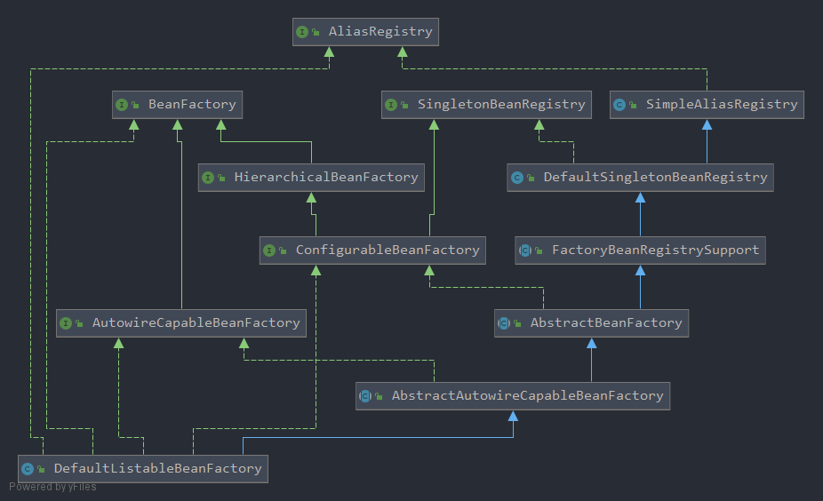

# SpringFramework源码解析——AbstractAutowireCapableBeanFactory

<!-- vscode-markdown-toc -->
* 1. [前言](#)
* 2. [类属性](#-1)
* 3. [#createBean创建Bean实例](#createBeanBean)
* 4. [#resolveBeanClass解析指定BeanDefinition的Classes](#resolveBeanClassBeanDefinitionClasses)
* 5. [AbstractBeanDefinition#prepareMethodOverrides处理Override属性](#AbstractBeanDefinitionprepareMethodOverridesOverride)
* 6. [#resolveBeforeInstantiation实例化的前置处置](#resolveBeforeInstantiation)
* 7. [#doCreateBean真正创建Bean](#doCreateBeanBean)
* 8. [#createBeanInstance创建Bean实例](#createBeanInstanceBean)
* 9. [#obtainFromSupplier根据Supplier创建beanInstance(优先级1)](#obtainFromSupplierSupplierbeanInstance1)
* 10. [#instantiateUsingFactoryMethod创建beanInstance(优先级2)](#instantiateUsingFactoryMethodbeanInstance2)
* 11. [#instantiateBean兜底创建beanInstance(优先级3)](#instantiateBeanbeanInstance3)
* 12. [#autowireConstructor带有参数构造beanInstance方法](#autowireConstructorbeanInstance)
* 13. [#instantiate实例化Bean](#instantiateBean)
* 14. [小结Bean的实例化](#Bean)

<!-- vscode-markdown-toc-config
	numbering=true
	autoSave=true
	/vscode-markdown-toc-config -->
<!-- /vscode-markdown-toc -->

##  1. <a name=''></a>前言

AbstractAutowireCapableBeanFactory继承了AbstractBeanFactory抽象基类，实现了AutowireCapableBeanFactory接口，UML模型图大概如下:

<div align=center></div>

根据Spring源码中对AbstractAutowireCapableBeanFactory对它的描述，可以大致总结为：

1. 实现了Bean的默认创建行为的抽象父类，具有RootBeanDefinition类中定义的完整的操控Bean的能力
2. 继承并实现了AbstractBeanFactory中的`#createBean`方法
3. **使用构造函数解析来完成Bean的创建，属性填充，连接(包括自动装配)，以及初始化**
4. 由子类实现的主模板方法是`#resolveDependency(...)` ，来完成**根据类型注入** 的操作
5. **此类并没有实现注册Bean的能力，相关的能力将会由DefaultListableBeanFactory完成**

##  2. <a name='-1'></a>类属性

```java
//AbstractAutowireCapableBeanFactory.java

	/** 创建bean实例的策略 */
	private InstantiationStrategy instantiationStrategy;

	/** 方法参数名的解析策略 */
	@Nullable
	private ParameterNameDiscoverer parameterNameDiscoverer = new DefaultParameterNameDiscoverer();

	/** 是否允许循环引用 */
	private boolean allowCircularReferences = true;

	/** 是否在循环引用的情况下求助于注入一个原始bean实例，即使被注入的bean最终被包装 */
	private boolean allowRawInjectionDespiteWrapping = false;

	/**
	 * 忽略注入的依赖类型，例如String类型
	 */
	private final Set<Class<?>> ignoredDependencyTypes = new HashSet<>();

	/**
	 * 依赖检查时忽略的接口类型
	 */
	private final Set<Class<?>> ignoredDependencyInterfaces = new HashSet<>();

	/**
	 * 当前正在创建的bean的名称
	 */
	private final NamedThreadLocal<String> currentlyCreatedBean = new NamedThreadLocal<>("Currently created bean");

	/** 工厂bean实例的缓存 */
	private final ConcurrentMap<String, BeanWrapper> factoryBeanInstanceCache = new ConcurrentHashMap<>();

	/** 每个工厂类的候选工厂方法的缓存 */
	private final ConcurrentMap<Class<?>, Method[]> factoryMethodCandidateCache = new ConcurrentHashMap<>();

	/** Cache of filtered PropertyDescriptors: bean Class to PropertyDescriptor array. */
	private final ConcurrentMap<Class<?>, PropertyDescriptor[]> filteredPropertyDescriptorsCache =
			new ConcurrentHashMap<>();
```

##  3. <a name='createBeanBean'></a>#createBean创建Bean实例

```java
//AbstractAutowireCapableBeanFactory.java
	@Override
	@SuppressWarnings("unchecked")
	public <T> T createBean(Class<T> beanClass) throws BeansException {
		// Use prototype bean definition, to avoid registering bean as dependent bean.
		RootBeanDefinition bd = new RootBeanDefinition(beanClass);
		bd.setScope(SCOPE_PROTOTYPE);
		bd.allowCaching = ClassUtils.isCacheSafe(beanClass, getBeanClassLoader());
		return (T) createBean(beanClass.getName(), bd, null);
	}

	@Override
	protected Object createBean(String beanName, RootBeanDefinition mbd, @Nullable Object[] args)
			throws BeanCreationException {

		if (logger.isTraceEnabled()) {
			logger.trace("Creating instance of bean '" + beanName + "'");
		}
        //<1>要创建的bean的RootBeanDefinition
		RootBeanDefinition mbdToUse = mbd;

		//<2>确保bean类在此时被实际解析，如果动态解析的class不能存储在共享合并bean定义中，则克隆bean定义
		Class<?> resolvedClass = resolveBeanClass(mbd, beanName);
		if (resolvedClass != null && !mbd.hasBeanClass() && mbd.getBeanClassName() != null) {
			mbdToUse = new RootBeanDefinition(mbd);
			mbdToUse.setBeanClass(resolvedClass);
		}

		// <3>准备方法重载
		try {
            //在RootBeanDefinition.java中
			mbdToUse.prepareMethodOverrides();
		}
		catch (BeanDefinitionValidationException ex) {
			throw new BeanDefinitionStoreException(mbdToUse.getResourceDescription(),
					beanName, "Validation of method overrides failed", ex);
		}

        
		try {
            //<4>
            // 前置处理器是否返回bean
			Object bean = resolveBeforeInstantiation(beanName, mbdToUse);
            //代理创建成功，直接返回
			if (bean != null) {
				return bean;
			}
		}
		catch (Throwable ex) {
			throw new BeanCreationException(mbdToUse.getResourceDescription(), beanName,
					"BeanPostProcessor before instantiation of bean failed", ex);
		}

		try {
            //<5>
            //走到这一步就说明前面没有设置代理
            //创建实际的目标bean
			Object beanInstance = doCreateBean(beanName, mbdToUse, args);
			if (logger.isTraceEnabled()) {
				logger.trace("Finished creating instance of bean '" + beanName + "'");
			}
			return beanInstance;
		}
		catch (BeanCreationException | ImplicitlyAppearedSingletonException ex) {
			// A previously detected exception with proper bean creation context already,
			// or illegal singleton state to be communicated up to DefaultSingletonBeanRegistry.
			throw ex;
		}
		catch (Throwable ex) {
			throw new BeanCreationException(
					mbdToUse.getResourceDescription(), beanName, "Unexpected exception during bean creation", ex);
		}
	}
```

##  4. <a name='resolveBeanClassBeanDefinitionClasses'></a>#resolveBeanClass解析指定BeanDefinition的Classes

```java
	protected Class<?> resolveBeanClass(RootBeanDefinition mbd, String beanName, Class<?>... typesToMatch)
			throws CannotLoadBeanClassException {

		try {
            //RootBeanDefinition中含有bean的Class对象
			if (mbd.hasBeanClass()) {
				return mbd.getBeanClass();
			}
			if (System.getSecurityManager() != null) {
				return AccessController.doPrivileged((PrivilegedExceptionAction<Class<?>>)
						() -> doResolveBeanClass(mbd, typesToMatch), getAccessControlContext());
			}
			else {
                // 真正开始解析的地方，实际上是使用类加载器进行加载
				return doResolveBeanClass(mbd, typesToMatch);
			}
		}
		catch (PrivilegedActionException pae) {
			ClassNotFoundException ex = (ClassNotFoundException) pae.getException();
			throw new CannotLoadBeanClassException(mbd.getResourceDescription(), beanName, mbd.getBeanClassName(), ex);
		}
		catch (ClassNotFoundException ex) {
			throw new CannotLoadBeanClassException(mbd.getResourceDescription(), beanName, mbd.getBeanClassName(), ex);
		}
		catch (LinkageError err) {
			throw new CannotLoadBeanClassException(mbd.getResourceDescription(), beanName, mbd.getBeanClassName(), err);
		}
	}
```

##  5. <a name='AbstractBeanDefinitionprepareMethodOverridesOverride'></a>AbstractBeanDefinition#prepareMethodOverrides处理Override属性

Bean的属性配置里面有一个`lookup-method`和`replace-method`属性，这两个属性就放置在BeanDefinition的`methodOverrides`属性中：

```java
//AbstractBeanDefinition.java
private MethodOverrides methodOverrides = new MethodOverrides();
```

Bean在实例化的过程中如果检测到存在`methodOverrides`，会**动态地为当前的Bean生成代理并使用对应的拦截器为Bean做增强处理** 。

```java
//AbstractBeanDefinition.java
	public void prepareMethodOverrides() throws BeanDefinitionValidationException {
		// Check that lookup methods exist and determine their overloaded status.
		if (hasMethodOverrides()) {
			getMethodOverrides().getOverrides().forEach(this::prepareMethodOverride);
		}
	}

	protected void prepareMethodOverride(MethodOverride mo) throws BeanDefinitionValidationException {
		int count = ClassUtils.getMethodCountForName(getBeanClass(), mo.getMethodName());
		if (count == 0) {
			throw new BeanDefinitionValidationException(
					"Invalid method override: no method with name '" + mo.getMethodName() +
					"' on class [" + getBeanClassName() + "]");
		}
		else if (count == 1) {
			// Mark override as not overloaded, to avoid the overhead of arg type checking.
			mo.setOverloaded(false);
		}
	}
```

- 根据方法名称，从 class 中获取该方法名的个数：
  - 如果个数为 0 ，则抛出 BeanDefinitionValidationException 异常。
  - 如果个数为 1 ，则设置该重载方法**没有被重载**。
- 若一个类中存在**多个**重载方法，则在方法调用的时候还需要根据参数类型来判断到底重载的是哪个方法。在设置重载的时候其实这里做了一个**小小优化**，那就是当 `count == 1` 时，设置 `overloaded = false` ，这样表示该方法没有重载。这样，在后续调用的时候，便可以直接找到方法而不需要进行方法参数的校验。

##  6. <a name='resolveBeforeInstantiation'></a>#resolveBeforeInstantiation实例化的前置处置

**该方法的作用是给BeanPostProcessors后置处理器返回一个代理对象的机会** 。在执行这个方法之前，Spring一直都没有创建Bean，**而这个方法，也是SpringAOP的一个切入点** 。

```java
//AbstractAutowireCapableBeanFactory.java
	protected Object resolveBeforeInstantiation(String beanName, RootBeanDefinition mbd) {
		Object bean = null;
		if (!Boolean.FALSE.equals(mbd.beforeInstantiationResolved)) {
			// Make sure bean class is actually resolved at this point.
			if (!mbd.isSynthetic() && hasInstantiationAwareBeanPostProcessors()) {
				Class<?> targetType = determineTargetType(beanName, mbd);
				if (targetType != null) {
                    //实例化的前置处置
					bean = applyBeanPostProcessorsBeforeInstantiation(targetType, beanName);
					if (bean != null) {
                        //实例化的后置处置
						bean = applyBeanPostProcessorsAfterInitialization(bean, beanName);
					}
				}
			}
			mbd.beforeInstantiationResolved = (bean != null);
		}
		return bean;
	}
```

**关于Bean的后置增强，之后会单独解析！！！！！！！！！！！！！！！！！！！！！！！！**

##  7. <a name='doCreateBeanBean'></a>#doCreateBean真正创建Bean

```java
//AbstractAutowireCapableBeanFactory.java
	protected Object doCreateBean(String beanName, RootBeanDefinition mbd, @Nullable Object[] args)
			throws BeanCreationException {

        // BeanWrapper 是对 Bean 的包装，其接口中所定义的功能很简单包括设置获取被包装的对象，获取被包装 bean 的属性描述器
		BeanWrapper instanceWrapper = null;
		if (mbd.isSingleton()) {
            // 单例模型，则从未完成的 FactoryBean 缓存中删除
			instanceWrapper = this.factoryBeanInstanceCache.remove(beanName);
		}
        // 使用合适的实例化策略来创建新的实例：工厂方法、构造函数自动注入、简单初始化
		if (instanceWrapper == null) {
			instanceWrapper = createBeanInstance(beanName, mbd, args);
		}
        // 获取bean的实例
		Object bean = instanceWrapper.getWrappedInstance();
        // 包装的bean实例对象的类型
		Class<?> beanType = instanceWrapper.getWrappedClass();
		if (beanType != NullBean.class) {
			mbd.resolvedTargetType = beanType;
		}

		// 判断是否有后置处理
    	// 如果有后置处理，则允许后置处理修改 BeanDefinition
		synchronized (mbd.postProcessingLock) {
			if (!mbd.postProcessed) {
				try {
                    // 后置处理修改 BeanDefinition
					applyMergedBeanDefinitionPostProcessors(mbd, beanType, beanName);
				}
				catch (Throwable ex) {
					throw new BeanCreationException(mbd.getResourceDescription(), beanName,
							"Post-processing of merged bean definition failed", ex);
				}
				mbd.postProcessed = true;
			}
		}

		// 循环依赖，单例允许循环依赖
		boolean earlySingletonExposure = (mbd.isSingleton() && this.allowCircularReferences &&
				isSingletonCurrentlyInCreation(beanName));
		if (earlySingletonExposure) {
			if (logger.isTraceEnabled()) {
				logger.trace("Eagerly caching bean '" + beanName +
						"' to allow for resolving potential circular references");
			}
            // 此时还没初始化完成，只是构造了，先把ObjectFactory加入到singletonFactories
            // 提前将创建的 bean 实例加入到 singletonFactories 中
        	// 这里是为了后期避免循环依赖
			addSingletonFactory(beanName, () -> getEarlyBeanReference(beanName, mbd, bean));
		}

		// 开始初始化 bean 实例对象
		Object exposedObject = bean;
		try {
            // 对 bean 进行填充，将各个属性值注入，其中，可能存在依赖于其他 bean 的属性
            // 则会递归初始依赖 bean
			populateBean(beanName, mbd, instanceWrapper);
            // 调用初始化方法init-method
			exposedObject = initializeBean(beanName, exposedObject, mbd);
		}
		catch (Throwable ex) {
			if (ex instanceof BeanCreationException && beanName.equals(((BeanCreationException) ex).getBeanName())) {
				throw (BeanCreationException) ex;
			}
			else {
				throw new BeanCreationException(
						mbd.getResourceDescription(), beanName, "Initialization of bean failed", ex);
			}
		}

        // 循环依赖处理
		if (earlySingletonExposure) {
            // 获取 earlySingletonReference
			Object earlySingletonReference = getSingleton(beanName, false);
            // 只有在存在循环依赖的情况下，earlySingletonReference 才不会为空
			if (earlySingletonReference != null) {
                // 如果 exposedObject 没有在初始化方法中被改变，也就是没有被增强
				if (exposedObject == bean) {
					exposedObject = earlySingletonReference;
				}
                // 处理依赖
				else if (!this.allowRawInjectionDespiteWrapping && hasDependentBean(beanName)) {
					String[] dependentBeans = getDependentBeans(beanName);
					Set<String> actualDependentBeans = new LinkedHashSet<>(dependentBeans.length);
					for (String dependentBean : dependentBeans) {
                        // 返回false说明依赖还没实例化好
						if (!removeSingletonIfCreatedForTypeCheckOnly(dependentBean)) {
							actualDependentBeans.add(dependentBean);
						}
					}
                    // actualDependentBeans不为空，说明依赖还没实例化好，抛异常
					if (!actualDependentBeans.isEmpty()) {
						throw new BeanCurrentlyInCreationException(beanName,
								"Bean with name '" + beanName + "' has been injected into other beans [" +
								StringUtils.collectionToCommaDelimitedString(actualDependentBeans) +
								"] in its raw version as part of a circular reference, but has eventually been " +
								"wrapped. This means that said other beans do not use the final version of the " +
								"bean. This is often the result of over-eager type matching - consider using " +
								"'getBeanNamesForType' with the 'allowEagerInit' flag turned off, for example.");
					}
				}
			}
		}

		// Register bean as disposable.
		try {
            // 根据scope注册DisposableBean
			registerDisposableBeanIfNecessary(beanName, bean, mbd);
		}
		catch (BeanDefinitionValidationException ex) {
			throw new BeanCreationException(
					mbd.getResourceDescription(), beanName, "Invalid destruction signature", ex);
		}

		return exposedObject;
	}
```

##  8. <a name='createBeanInstanceBean'></a>#createBeanInstance创建Bean实例

```java
	protected BeanWrapper createBeanInstance(String beanName, RootBeanDefinition mbd, @Nullable Object[] args) {
		// 解析 bean ，将 bean 类名解析为 class 引用
		Class<?> beanClass = resolveBeanClass(mbd, beanName);

		if (beanClass != null && !Modifier.isPublic(beanClass.getModifiers()) && !mbd.isNonPublicAccessAllowed()) {
			throw new BeanCreationException(mbd.getResourceDescription(), beanName,
					"Bean class isn't public, and non-public access not allowed: " + beanClass.getName());
		}

        // <1> 如果存在 Supplier 回调，则使用给定的回调方法初始化策略
		Supplier<?> instanceSupplier = mbd.getInstanceSupplier();
		if (instanceSupplier != null) {
			return obtainFromSupplier(instanceSupplier, beanName);
		}

        // <2> 使用 FactoryBean 的 factory-method 来创建，支持静态工厂和实例工厂
		if (mbd.getFactoryMethodName() != null) {
			return instantiateUsingFactoryMethod(beanName, mbd, args);
		}

		// Shortcut when re-creating the same bean...
		boolean resolved = false;
		boolean autowireNecessary = false;
		if (args == null) {
            // constructorArgumentLock 构造函数的常用锁
			synchronized (mbd.constructorArgumentLock) {
                // 如果已缓存的解析的构造函数或者工厂方法不为空，则可以利用构造函数解析
            	// 因为需要根据参数确认到底使用哪个构造函数，该过程比较消耗性能，所有采用缓存机制
				if (mbd.resolvedConstructorOrFactoryMethod != null) {
					resolved = true;
					autowireNecessary = mbd.constructorArgumentsResolved;
				}
			}
		}
        
        // 已经解析好了，直接注入即可
		if (resolved) {
			if (autowireNecessary) {
				// <3.1> autowire 自动注入，调用构造函数自动注入
				return autowireConstructor(beanName, mbd, null, null);
			}
			else {
                // <3.2> 使用默认构造函数构造
				return instantiateBean(beanName, mbd);
			}
		}

		// <4> 确定解析的构造函数
    	// 主要是检查已经注册的 SmartInstantiationAwareBeanPostProcessor
		Constructor<?>[] ctors = determineConstructorsFromBeanPostProcessors(beanClass, beanName);
        // <4.1> 有参数情况时，创建 Bean 。先利用参数个数，类型等，确定最精确匹配的构造方法。
		if (ctors != null || mbd.getResolvedAutowireMode() == AUTOWIRE_CONSTRUCTOR ||
				mbd.hasConstructorArgumentValues() || !ObjectUtils.isEmpty(args)) {
			return autowireConstructor(beanName, mbd, ctors, args);
		}

        // <4.1> 选择构造方法，创建 Bean 。
		ctors = mbd.getPreferredConstructors();
		if (ctors != null) {
			return autowireConstructor(beanName, mbd, ctors, null);
		}

		// No special handling: simply use no-arg constructor.
        // <4.2> 有参数时，又没获取到构造方法，则只能调用无参构造方法来创建实例了(兜底方法)
		return instantiateBean(beanName, mbd);
	}
```

##  9. <a name='obtainFromSupplierSupplierbeanInstance1'></a>#obtainFromSupplier根据Supplier创建beanInstance(优先级1)

那么 Supplier 是什么呢？在这之前也没有提到过这个字段。`java.util.function.Supplier` 接口，代码如下：

```java
public interface Supplier<T> {
    T get();
}
```

- Supplier 接口仅有一个功能性的 `#get()` 方法，该方法会返回一个 `<T>` 类型的对象，有点儿类似工厂方法。
- 这个接口有什么作用？用于指定创建 bean 的回调。**如果我们设置了这样的回调，那么其他的构造器或者工厂方法都会没有用**。 

在什么设置该 Supplier 参数呢？Spring 提供了相应的 setter 方法，如下：

```java
// AbstractBeanDefinition.java

/**
 * 创建 Bean 的 Supplier 对象
 */
@Nullable
private Supplier<?> instanceSupplier;

public void setInstanceSupplier(@Nullable Supplier<?> instanceSupplier) {
	this.instanceSupplier = instanceSupplier;
}
```

在构造 BeanDefinition 对象的时候，设置了 `instanceSupplier` 该值，代码如下（以 RootBeanDefinition 为例）：

```java
// RootBeanDefinition.java

public <T> RootBeanDefinition(@Nullable Class<T> beanClass, String scope, @Nullable Supplier<T> instanceSupplier) {
	super();
	setBeanClass(beanClass);
	setScope(scope);
	// 设置 instanceSupplier 属性
	setInstanceSupplier(instanceSupplier);
}
```

如果设置了 `instanceSupplier` 属性，则可以调用 `#obtainFromSupplier(Supplier<?> instanceSupplier, String beanName)` 方法，完成 Bean 的初始化。代码如下：

```java
// AbstractAutowireCapableBeanFactory.java

/**
 * 当前线程，正在创建的 Bean 对象的名字
 *
 * The name of the currently created bean, for implicit dependency registration
 * on getBean etc invocations triggered from a user-specified Supplier callback.
 */
private final NamedThreadLocal<String> currentlyCreatedBean = new NamedThreadLocal<>("Currently created bean");

protected BeanWrapper obtainFromSupplier(Supplier<?> instanceSupplier, String beanName) {
    Object instance;
    // 获得原创建的 Bean 的对象名
    String outerBean = this.currentlyCreatedBean.get();
    // 设置新的 Bean 的对象名，到 currentlyCreatedBean 中
    this.currentlyCreatedBean.set(beanName);
    try {
        // <1> 调用 Supplier 的 get()，返回一个 Bean 对象
        instance = instanceSupplier.get();
    } finally {
        // 设置原创建的 Bean 的对象名，到 currentlyCreatedBean 中
        if (outerBean != null) {
            this.currentlyCreatedBean.set(outerBean);
        } else {
            this.currentlyCreatedBean.remove();
        }
    }

    // 未创建 Bean 对象，则创建 NullBean 对象
    if (instance == null) {
        instance = new NullBean();
    }
    // <2> 创建 BeanWrapper 对象
    BeanWrapper bw = new BeanWrapperImpl(instance);
    // <3> 初始化 BeanWrapper 对象
    initBeanWrapper(bw);
    return bw;
}
```

##  10. <a name='instantiateUsingFactoryMethodbeanInstance2'></a>#instantiateUsingFactoryMethod创建beanInstance(优先级2)

如果存在工厂方法，则调用 `#instantiateUsingFactoryMethod(String beanName, RootBeanDefinition mbd, @Nullable Object[] explicitArgs)` 方法完成 bean 的初始化工作（方法实现比较长，细节比较复杂，**各位就硬着头皮看吧**）。代码如下：

```java
// AbstractAutowireCapableBeanFactory.java

protected BeanWrapper instantiateUsingFactoryMethod(String beanName, RootBeanDefinition mbd, @Nullable Object[] explicitArgs) {
	return new ConstructorResolver(this).instantiateUsingFactoryMethod(beanName, mbd, explicitArgs);
}
```

```java
// ConstructorResolver.java

public BeanWrapper instantiateUsingFactoryMethod(
        String beanName, RootBeanDefinition mbd, @Nullable Object[] explicitArgs) {
    // 构造 BeanWrapperImpl 对象
    BeanWrapperImpl bw = new BeanWrapperImpl();
    // 初始化 BeanWrapperImpl
    // 向BeanWrapper对象中添加 ConversionService 对象和属性编辑器 PropertyEditor 对象
    this.beanFactory.initBeanWrapper(bw);

    // <1> 获得 factoryBean、factoryClass、isStatic、factoryBeanName 属性
    Object factoryBean;
    Class<?> factoryClass;
    boolean isStatic;
    String factoryBeanName = mbd.getFactoryBeanName();

    // 工厂名不为空
    if (factoryBeanName != null) {
        if (factoryBeanName.equals(beanName)) { // 抛出 BeanDefinitionStoreException 异常
            throw new BeanDefinitionStoreException(mbd.getResourceDescription(), beanName,
                    "factory-bean reference points back to the same bean definition");
        }
        // 获取工厂实例
        factoryBean = this.beanFactory.getBean(factoryBeanName);
        if (mbd.isSingleton() && this.beanFactory.containsSingleton(beanName)) { // 抛出 ImplicitlyAppearedSingletonException 异常
            throw new ImplicitlyAppearedSingletonException();
        }
        factoryClass = factoryBean.getClass();
        isStatic = false;
    } else {
        // 工厂名为空，则其可能是一个静态工厂
        // 静态工厂创建bean，必须要提供工厂的全类名
        // It's a static factory method on the bean class.
        if (!mbd.hasBeanClass()) {
            throw new BeanDefinitionStoreException(mbd.getResourceDescription(), beanName,
                    "bean definition declares neither a bean class nor a factory-bean reference");
        }
        factoryBean = null;
        factoryClass = mbd.getBeanClass();
        isStatic = true;
    }

    // <2> 获得 factoryMethodToUse、argsHolderToUse、argsToUse 属性
    Method factoryMethodToUse = null;  // 工厂方法
    ArgumentsHolder argsHolderToUse = null;
    Object[] argsToUse = null; // 参数

    // <2.1> 如果指定了构造参数则直接使用
    // 在调用 getBean 方法的时候指定了方法参数
    if (explicitArgs != null) {
        argsToUse = explicitArgs;
    } else {
        // 没有指定，则尝试从配置文件中解析
        Object[] argsToResolve = null;
        // <2.2> 首先尝试从缓存中获取
        synchronized (mbd.constructorArgumentLock) {
            // 获取缓存中的构造函数或者工厂方法
            factoryMethodToUse = (Method) mbd.resolvedConstructorOrFactoryMethod;
            if (factoryMethodToUse != null && mbd.constructorArgumentsResolved) {
                // Found a cached factory method...
                // 获取缓存中的构造参数
                argsToUse = mbd.resolvedConstructorArguments;
                if (argsToUse == null) {
                    // 获取缓存中的构造函数参数的包可见字段
                    argsToResolve = mbd.preparedConstructorArguments;
                }
            }
        }
        // 缓存中存在,则解析存储在 BeanDefinition 中的参数
        // 如给定方法的构造函数 A(int ,int )，则通过此方法后就会把配置文件中的("1","1")转换为 (1,1)
        // 缓存中的值可能是原始值也有可能是最终值
        if (argsToResolve != null) {
            argsToUse = resolvePreparedArguments(beanName, mbd, bw, factoryMethodToUse, argsToResolve, true);
        }
    }

    // <3> 
    if (factoryMethodToUse == null || argsToUse == null) {
        // Need to determine the factory method...
        // Try all methods with this name to see if they match the given arguments.
        // 获取工厂方法的类全名称
        factoryClass = ClassUtils.getUserClass(factoryClass);

        // 获取所有待定方法
        Method[] rawCandidates = getCandidateMethods(factoryClass, mbd);
        // 检索所有方法，这里是对方法进行过滤
        List<Method> candidateList = new ArrayList<>();
        for (Method candidate : rawCandidates) {
            // 如果有static 且为工厂方法，则添加到 candidateSet 中
            if (Modifier.isStatic(candidate.getModifiers()) == isStatic && mbd.isFactoryMethod(candidate)) {
                candidateList.add(candidate);
            }
        }

        // 创建 Bean
        if (candidateList.size() == 1 && explicitArgs == null && !mbd.hasConstructorArgumentValues()) {
            Method uniqueCandidate = candidateList.get(0);
            if (uniqueCandidate.getParameterCount() == 0) {
                synchronized (mbd.constructorArgumentLock) {
                    mbd.resolvedConstructorOrFactoryMethod = uniqueCandidate;
                    mbd.constructorArgumentsResolved = true;
                    mbd.resolvedConstructorArguments = EMPTY_ARGS;
                }
                bw.setBeanInstance(instantiate(beanName, mbd, factoryBean, uniqueCandidate, EMPTY_ARGS));
                return bw;
            }
        }

        Method[] candidates = candidateList.toArray(new Method[0]);
        // 排序构造函数
        // public 构造函数优先参数数量降序，非 public 构造函数参数数量降序
        AutowireUtils.sortFactoryMethods(candidates);

        // 用于承载解析后的构造函数参数的值
        ConstructorArgumentValues resolvedValues = null;
        boolean autowiring = (mbd.getResolvedAutowireMode() == AutowireCapableBeanFactory.AUTOWIRE_CONSTRUCTOR);
        int minTypeDiffWeight = Integer.MAX_VALUE;
        Set<Method> ambiguousFactoryMethods = null;

        int minNrOfArgs;
        if (explicitArgs != null) {
            minNrOfArgs = explicitArgs.length;
        } else {
            // We don't have arguments passed in programmatically, so we need to resolve the
            // arguments specified in the constructor arguments held in the bean definition.
            // <2.3> getBean() 没有传递参数，则需要解析保存在 BeanDefinition 构造函数中指定的参数
            if (mbd.hasConstructorArgumentValues()) {
                // 构造函数的参数
                ConstructorArgumentValues cargs = mbd.getConstructorArgumentValues();
                resolvedValues = new ConstructorArgumentValues();
                // 解析构造函数的参数
                // 将该 bean 的构造函数参数解析为 resolvedValues 对象，其中会涉及到其他 bean
                minNrOfArgs = resolveConstructorArguments(beanName, mbd, bw, cargs, resolvedValues);
            } else {
                minNrOfArgs = 0;
            }
        }

        LinkedList<UnsatisfiedDependencyException> causes = null; // 记录 UnsatisfiedDependencyException 异常的集合
        // 遍历 candidates 数组
        for (Method candidate : candidates) {
            // 方法体的参数
            Class<?>[] paramTypes = candidate.getParameterTypes();

            if (paramTypes.length >= minNrOfArgs) {
                // 保存参数的对象
                ArgumentsHolder argsHolder;

                // #getBean(...) 传递了参数
                if (explicitArgs != null) {
                    // Explicit arguments given -> arguments length must match exactly.
                    // 显示给定参数，参数长度必须完全匹配
                    if (paramTypes.length != explicitArgs.length) {
                        continue;
                    }
                    // 根据参数创建参数持有者 ArgumentsHolder 对象
                    argsHolder = new ArgumentsHolder(explicitArgs);
                } else {
                    // Resolved constructor arguments: type conversion and/or autowiring necessary.
                    // 为提供参数，解析构造参数
                    try {
                        String[] paramNames = null;
                        // 获取 ParameterNameDiscoverer 对象
                        // ParameterNameDiscoverer 是用于解析方法和构造函数的参数名称的接口，为参数名称探测器
                        ParameterNameDiscoverer pnd = this.beanFactory.getParameterNameDiscoverer();
                        // 获取指定构造函数的参数名称
                        if (pnd != null) {
                            paramNames = pnd.getParameterNames(candidate);
                        }
                        // 在已经解析的构造函数参数值的情况下，创建一个参数持有者 ArgumentsHolder 对象
                        argsHolder = createArgumentArray(beanName, mbd, resolvedValues, bw,
                                paramTypes, paramNames, candidate, autowiring, candidates.length == 1);
                    } catch (UnsatisfiedDependencyException ex) {
                        // 若发生 UnsatisfiedDependencyException 异常，添加到 causes 中。
                        if (logger.isTraceEnabled()) {
                            logger.trace("Ignoring factory method [" + candidate + "] of bean '" + beanName + "': " + ex);
                        }
                        // Swallow and try next overloaded factory method.
                        if (causes == null) {
                            causes = new LinkedList<>();
                        }
                        causes.add(ex);
                        continue; // continue ，继续执行
                    }
                }

                // isLenientConstructorResolution 判断解析构造函数的时候是否以宽松模式还是严格模式
                // 严格模式：解析构造函数时，必须所有的都需要匹配，否则抛出异常
                // 宽松模式：使用具有"最接近的模式"进行匹配
                // typeDiffWeight：类型差异权重
                int typeDiffWeight = (mbd.isLenientConstructorResolution() ?
                        argsHolder.getTypeDifferenceWeight(paramTypes) : argsHolder.getAssignabilityWeight(paramTypes));
                // Choose this factory method if it represents the closest match.
                // 代表最接近的类型匹配，则选择作为构造函数
                if (typeDiffWeight < minTypeDiffWeight) {
                    factoryMethodToUse = candidate;
                    argsHolderToUse = argsHolder;
                    argsToUse = argsHolder.arguments;
                    minTypeDiffWeight = typeDiffWeight;
                    ambiguousFactoryMethods = null;
                }
                // Find out about ambiguity: In case of the same type difference weight
                // for methods with the same number of parameters, collect such candidates
                // and eventually raise an ambiguity exception.
                // However, only perform that check in non-lenient constructor resolution mode,
                // and explicitly ignore overridden methods (with the same parameter signature).
                // 如果具有相同参数数量的方法具有相同的类型差异权重，则收集此类型选项
                // 但是，仅在非宽松构造函数解析模式下执行该检查，并显式忽略重写方法（具有相同的参数签名）
                else if (factoryMethodToUse != null && typeDiffWeight == minTypeDiffWeight &&
                        !mbd.isLenientConstructorResolution() &&
                        paramTypes.length == factoryMethodToUse.getParameterCount() &&
                        !Arrays.equals(paramTypes, factoryMethodToUse.getParameterTypes())) {
                    // 查找到多个可匹配的方法
                    if (ambiguousFactoryMethods == null) {
                        ambiguousFactoryMethods = new LinkedHashSet<>();
                        ambiguousFactoryMethods.add(factoryMethodToUse);
                    }
                    ambiguousFactoryMethods.add(candidate);
                }
            }
        }

        // 没有可执行的工厂方法，抛出异常
        if (factoryMethodToUse == null) {
            if (causes != null) {
                UnsatisfiedDependencyException ex = causes.removeLast();
                for (Exception cause : causes) {
                    this.beanFactory.onSuppressedException(cause);
                }
                throw ex;
            }
            List<String> argTypes = new ArrayList<>(minNrOfArgs);
            if (explicitArgs != null) {
                for (Object arg : explicitArgs) {
                    argTypes.add(arg != null ? arg.getClass().getSimpleName() : "null");
                }
            } else if (resolvedValues != null) {
                Set<ValueHolder> valueHolders = new LinkedHashSet<>(resolvedValues.getArgumentCount());
                valueHolders.addAll(resolvedValues.getIndexedArgumentValues().values());
                valueHolders.addAll(resolvedValues.getGenericArgumentValues());
                for (ValueHolder value : valueHolders) {
                    String argType = (value.getType() != null ? ClassUtils.getShortName(value.getType()) :
                            (value.getValue() != null ? value.getValue().getClass().getSimpleName() : "null"));
                    argTypes.add(argType);
                }
            }
            String argDesc = StringUtils.collectionToCommaDelimitedString(argTypes);
            throw new BeanCreationException(mbd.getResourceDescription(), beanName,
                    "No matching factory method found: " +
                    (mbd.getFactoryBeanName() != null ?
                        "factory bean '" + mbd.getFactoryBeanName() + "'; " : "") +
                    "factory method '" + mbd.getFactoryMethodName() + "(" + argDesc + ")'. " +
                    "Check that a method with the specified name " +
                    (minNrOfArgs > 0 ? "and arguments " : "") +
                    "exists and that it is " +
                    (isStatic ? "static" : "non-static") + ".");
        } else if (void.class == factoryMethodToUse.getReturnType()) {
            throw new BeanCreationException(mbd.getResourceDescription(), beanName,
                    "Invalid factory method '" + mbd.getFactoryMethodName() +
                    "': needs to have a non-void return type!");
        } else if (ambiguousFactoryMethods != null) {
            throw new BeanCreationException(mbd.getResourceDescription(), beanName,
                    "Ambiguous factory method matches found in bean '" + beanName + "' " +
                    "(hint: specify index/type/name arguments for simple parameters to avoid type ambiguities): " +
                    ambiguousFactoryMethods);
        }

        if (explicitArgs == null && argsHolderToUse != null) {
            // 将解析的构造函数加入缓存
            argsHolderToUse.storeCache(mbd, factoryMethodToUse);
        }
    }

    // 创建 Bean 对象，并设置到 bw 中
    bw.setBeanInstance(instantiate(beanName, mbd, factoryBean, factoryMethodToUse, argsToUse));
    return bw;
}

private Object instantiate(
        String beanName, RootBeanDefinition mbd, Constructor constructorToUse, Object[] argsToUse) {

    try {
        InstantiationStrategy strategy = this.beanFactory.getInstantiationStrategy();
        if (System.getSecurityManager() != null) {
            return AccessController.doPrivileged((PrivilegedAction<Object>) () ->
                    strategy.instantiate(mbd, beanName, this.beanFactory, constructorToUse, argsToUse),
                    this.beanFactory.getAccessControlContext());
        } else {
            return strategy.instantiate(mbd, beanName, this.beanFactory, constructorToUse, argsToUse);
        }
    } catch (Throwable ex) {
        throw new BeanCreationException(mbd.getResourceDescription(), beanName,
                "Bean instantiation via constructor failed", ex);
    }
}
```

**确定工厂对象，然后获取构造函数和构造参数，最后调用 InstantiationStrategy 对象的 `#instantiate(RootBeanDefinition bd, String beanName, BeanFactory owner, Constructor<?> ctor, Object... args)` 方法，来创建 Bean 实例**。

##  11. <a name='instantiateBeanbeanInstance3'></a>#instantiateBean兜底创建beanInstance(优先级3)

有参数时，又没获取到构造方法，则只能调用无参构造方法来创建实例了(兜底方法)

```java
	protected BeanWrapper instantiateBean(String beanName, RootBeanDefinition mbd) {
		try {
			Object beanInstance;
			if (System.getSecurityManager() != null) {
				beanInstance = AccessController.doPrivileged(
						(PrivilegedAction<Object>) () -> getInstantiationStrategy().instantiate(mbd, beanName, this),
						getAccessControlContext());
			}
			else {
				beanInstance = getInstantiationStrategy().instantiate(mbd, beanName, this);
			}
			BeanWrapper bw = new BeanWrapperImpl(beanInstance);
			initBeanWrapper(bw);
			return bw;
		}
		catch (Throwable ex) {
			throw new BeanCreationException(
					mbd.getResourceDescription(), beanName, "Instantiation of bean failed", ex);
		}
	}
```

##  12. <a name='autowireConstructorbeanInstance'></a>#autowireConstructor带有参数构造beanInstance方法

这个初始化方法，我们可以简单理解为是**带有参数的构造方法**，来初始化 Bean 对象。代码段如下：

```java
// AbstractAutowireCapableBeanFactory.java

protected BeanWrapper autowireConstructor(String beanName, RootBeanDefinition mbd, @Nullable Constructor<?>[] ctors, @Nullable Object[] explicitArgs) {
    return new ConstructorResolver(this).autowireConstructor(beanName, mbd, ctors, explicitArgs);
}

// ConstructorResolver.java

public BeanWrapper autowireConstructor(String beanName, RootBeanDefinition mbd,
        @Nullable Constructor<?>[] chosenCtors, @Nullable Object[] explicitArgs) {
    // 封装 BeanWrapperImpl 对象，并完成初始化
    BeanWrapperImpl bw = new BeanWrapperImpl();
    this.beanFactory.initBeanWrapper(bw);

    // 获得 constructorToUse、argsHolderToUse、argsToUse
    Constructor<?> constructorToUse = null; // 构造函数
    ArgumentsHolder argsHolderToUse = null; // 构造参数
    Object[] argsToUse = null; // 构造参数

    // 确定构造参数
    // 如果 getBean() 已经传递，则直接使用
    if (explicitArgs != null) {
        argsToUse = explicitArgs;
    } else {
        // 尝试从缓存中获取
        Object[] argsToResolve = null;
        synchronized (mbd.constructorArgumentLock) {
            // 缓存中的构造函数或者工厂方法
            constructorToUse = (Constructor<?>) mbd.resolvedConstructorOrFactoryMethod;
            if (constructorToUse != null && mbd.constructorArgumentsResolved) {
                // Found a cached constructor...
                // 缓存中的构造参数
                argsToUse = mbd.resolvedConstructorArguments;
                if (argsToUse == null) {
                    argsToResolve = mbd.preparedConstructorArguments;
                }
            }
        }
        // 缓存中存在,则解析存储在 BeanDefinition 中的参数
        // 如给定方法的构造函数 A(int ,int )，则通过此方法后就会把配置文件中的("1","1")转换为 (1,1)
        // 缓存中的值可能是原始值也有可能是最终值
        if (argsToResolve != null) {
            argsToUse = resolvePreparedArguments(beanName, mbd, bw, constructorToUse, argsToResolve, true);
        }
    }

    // 没有缓存，则尝试从配置文件中获取参数
    if (constructorToUse == null || argsToUse == null) {
        // Take specified constructors, if any.
        // 如果 chosenCtors 未传入，则获取构造方法们
        Constructor<?>[] candidates = chosenCtors;
        if (candidates == null) {
            Class<?> beanClass = mbd.getBeanClass();
            try {
                candidates = (mbd.isNonPublicAccessAllowed() ?
                        beanClass.getDeclaredConstructors() : beanClass.getConstructors());
            } catch (Throwable ex) {
                throw new BeanCreationException(mbd.getResourceDescription(), beanName,
                        "Resolution of declared constructors on bean Class [" + beanClass.getName() +
                        "] from ClassLoader [" + beanClass.getClassLoader() + "] failed", ex);
            }
        }

        // TODO 芋艿 创建 Bean
        if (candidates.length == 1 && explicitArgs == null && !mbd.hasConstructorArgumentValues()) {
            Constructor<?> uniqueCandidate = candidates[0];
            if (uniqueCandidate.getParameterCount() == 0) {
                synchronized (mbd.constructorArgumentLock) {
                    mbd.resolvedConstructorOrFactoryMethod = uniqueCandidate;
                    mbd.constructorArgumentsResolved = true;
                    mbd.resolvedConstructorArguments = EMPTY_ARGS;
                }
                bw.setBeanInstance(instantiate(beanName, mbd, uniqueCandidate, EMPTY_ARGS));
                return bw;
            }
        }

        // 是否需要解析构造器
        // Need to resolve the constructor.
        boolean autowiring = (chosenCtors != null ||
                mbd.getResolvedAutowireMode() == AutowireCapableBeanFactory.AUTOWIRE_CONSTRUCTOR);
        // 用于承载解析后的构造函数参数的值
        ConstructorArgumentValues resolvedValues = null;
        int minNrOfArgs;
        if (explicitArgs != null) {
            minNrOfArgs = explicitArgs.length;
        } else {
            // 从 BeanDefinition 中获取构造参数，也就是从配置文件中提取构造参数
            ConstructorArgumentValues cargs = mbd.getConstructorArgumentValues();
            resolvedValues = new ConstructorArgumentValues();
            // 解析构造函数的参数
            // 将该 bean 的构造函数参数解析为 resolvedValues 对象，其中会涉及到其他 bean
            minNrOfArgs = resolveConstructorArguments(beanName, mbd, bw, cargs, resolvedValues);
        }

        // 对构造函数进行排序处理
        // public 构造函数优先参数数量降序，非public 构造函数参数数量降序
        AutowireUtils.sortConstructors(candidates);

        // 最小参数类型权重
        int minTypeDiffWeight = Integer.MAX_VALUE;
        Set<Constructor<?>> ambiguousConstructors = null;
        LinkedList<UnsatisfiedDependencyException> causes = null;

        // 迭代所有构造函数
        for (Constructor<?> candidate : candidates) {
            // 获取该构造函数的参数类型
            Class<?>[] paramTypes = candidate.getParameterTypes();

            // 如果已经找到选用的构造函数或者需要的参数个数小于当前的构造函数参数个数，则终止。
            // 因为，已经按照参数个数降序排列了
            if (constructorToUse != null && argsToUse.length > paramTypes.length) {
                // Already found greedy constructor that can be satisfied ->
                // do not look any further, there are only less greedy constructors left.
                break;
            }
            // 参数个数不等，继续
            if (paramTypes.length < minNrOfArgs) {
                continue;
            }

            // 参数持有者 ArgumentsHolder 对象
            ArgumentsHolder argsHolder;
            if (resolvedValues != null) {
                try {
                    // 注释上获取参数名称
                    String[] paramNames = ConstructorPropertiesChecker.evaluate(candidate, paramTypes.length);
                    if (paramNames == null) {
                        // 获取构造函数、方法参数的探测器
                        ParameterNameDiscoverer pnd = this.beanFactory.getParameterNameDiscoverer();
                        if (pnd != null) {
                            // 通过探测器获取构造函数的参数名称
                            paramNames = pnd.getParameterNames(candidate);
                        }
                    }
                    // 根据构造函数和构造参数，创建参数持有者 ArgumentsHolder 对象
                    argsHolder = createArgumentArray(beanName, mbd, resolvedValues, bw, paramTypes, paramNames,
                            getUserDeclaredConstructor(candidate), autowiring, candidates.length == 1);
                } catch (UnsatisfiedDependencyException ex) {
                    // 若发生 UnsatisfiedDependencyException 异常，添加到 causes 中。
                    if (logger.isTraceEnabled()) {
                        logger.trace("Ignoring constructor [" + candidate + "] of bean '" + beanName + "': " + ex);
                    }
                    // Swallow and try next constructor.
                    if (causes == null) {
                        causes = new LinkedList<>();
                    }
                    causes.add(ex);
                    continue; // continue ，继续执行
                }
            } else {
                // continue 构造函数没有参数
                // Explicit arguments given -> arguments length must match exactly.
                if (paramTypes.length != explicitArgs.length) {
                    continue;
                }
                // 根据 explicitArgs ，创建 ArgumentsHolder 对象
                argsHolder = new ArgumentsHolder(explicitArgs);
            }

            // isLenientConstructorResolution 判断解析构造函数的时候是否以宽松模式还是严格模式
            // 严格模式：解析构造函数时，必须所有的都需要匹配，否则抛出异常
            // 宽松模式：使用具有"最接近的模式"进行匹配
            // typeDiffWeight：类型差异权重
            int typeDiffWeight = (mbd.isLenientConstructorResolution() ?
                    argsHolder.getTypeDifferenceWeight(paramTypes) : argsHolder.getAssignabilityWeight(paramTypes));
            // Choose this constructor if it represents the closest match.
            // 如果它代表着当前最接近的匹配则选择其作为构造函数
            if (typeDiffWeight < minTypeDiffWeight) {
                constructorToUse = candidate;
                argsHolderToUse = argsHolder;
                argsToUse = argsHolder.arguments;
                minTypeDiffWeight = typeDiffWeight;
                ambiguousConstructors = null;
            } else if (constructorToUse != null && typeDiffWeight == minTypeDiffWeight) {
                if (ambiguousConstructors == null) {
                    ambiguousConstructors = new LinkedHashSet<>();
                    ambiguousConstructors.add(constructorToUse);
                }
                ambiguousConstructors.add(candidate);
            }
        }

        // 没有可执行的工厂方法，抛出异常
        if (constructorToUse == null) {
            if (causes != null) {
                UnsatisfiedDependencyException ex = causes.removeLast();
                for (Exception cause : causes) {
                    this.beanFactory.onSuppressedException(cause);
                }
                throw ex;
            }
            throw new BeanCreationException(mbd.getResourceDescription(), beanName,
                    "Could not resolve matching constructor " +
                    "(hint: specify index/type/name arguments for simple parameters to avoid type ambiguities)");
        } else if (ambiguousConstructors != null && !mbd.isLenientConstructorResolution()) {
            throw new BeanCreationException(mbd.getResourceDescription(), beanName,
                    "Ambiguous constructor matches found in bean '" + beanName + "' " +
                    "(hint: specify index/type/name arguments for simple parameters to avoid type ambiguities): " +
                    ambiguousConstructors);
        }

        if (explicitArgs == null) {
            // 将解析的构造函数加入缓存
            argsHolderToUse.storeCache(mbd, constructorToUse);
        }
    }

    // 创建 Bean 对象，并设置到 bw 中
    bw.setBeanInstance(instantiate(beanName, mbd, constructorToUse, argsToUse));
    return bw;
}
```

一句话概括：首先确定构造函数参数、构造函数，然后调用相应的初始化策略进行 bean 的初始化。关于如何确定构造函数、构造参数，该部分逻辑和 `#instantiateUsingFactoryMethod(...)` 方法，基本一致。所以这里不再重复阐述了

##  13. <a name='instantiateBean'></a>#instantiate实例化Bean

```java
// BeanUtils.java

public static <T> T instantiateClass(Constructor<T> ctor, Object... args) throws BeanInstantiationException {
    Assert.notNull(ctor, "Constructor must not be null");
    try {
        // 设置构造方法，可访问
        ReflectionUtils.makeAccessible(ctor);
        // 使用构造方法，创建对象
        return (KotlinDetector.isKotlinReflectPresent() && KotlinDetector.isKotlinType(ctor.getDeclaringClass()) ?
                KotlinDelegate.instantiateClass(ctor, args) : ctor.newInstance(args));
    // 各种异常的翻译，最终统一抛出 BeanInstantiationException 异常
    } catch (InstantiationException ex) {
        throw new BeanInstantiationException(ctor, "Is it an abstract class?", ex);
    } catch (IllegalAccessException ex) {
        throw new BeanInstantiationException(ctor, "Is the constructor accessible?", ex);
    } catch (IllegalArgumentException ex) {
        throw new BeanInstantiationException(ctor, "Illegal arguments for constructor", ex);
    } catch (InvocationTargetException ex) {
        throw new BeanInstantiationException(ctor, "Constructor threw exception", ex.getTargetException());
    }
}
```

- `<1>` 首先，是获取实例化 Bean 的策略 InstantiationStrategy 对象。
- `<2>` 然后，调用其 `#instantiate(RootBeanDefinition bd, String beanName, BeanFactory owner, Constructor<?> ctor, Object... args)` 方法，该方法在 SimpleInstantiationStrategy 中实现。代码如下：

```java
// SimpleInstantiationStrategy.java

@Override
public Object instantiate(RootBeanDefinition bd, @Nullable String beanName, BeanFactory owner,
        final Constructor<?> ctor, Object... args) {
    // <x1> 没有覆盖，直接使用反射实例化即可
    if (!bd.hasMethodOverrides()) {
        if (System.getSecurityManager() != null) {
            // 设置构造方法，可访问
            // use own privileged to change accessibility (when security is on)
            AccessController.doPrivileged((PrivilegedAction<Object>) () -> {
                ReflectionUtils.makeAccessible(ctor);
                return null;
            });
        }
        // 通过 BeanUtils 直接使用构造器对象实例化 Bean 对象
        return BeanUtils.instantiateClass(ctor, args);
    } else {
        // <x2> 生成 CGLIB 创建的子类对象
        return instantiateWithMethodInjection(bd, beanName, owner, ctor, args);
    }
}
```

* `<1>` 处，如果该Bean没有配置`lookup-method`，`replace-method`或者`@Lookup`注解，直接通过反射方式获得Bean
* `<2>`处，如果存在需要覆盖的方法，则需要CGLIB动态代理，因为可以在创建代理的同时将动态方法织入类中

##  14. <a name='Bean'></a>小结Bean的实例化

对于 `#createBeanInstance(...)` 方法而言，他就是**选择合适实例化策略**来为 bean 创建实例对象，具体的策略有：

- Supplier 回调方式
- 工厂方法初始化
- 构造函数自动注入初始化
- 默认构造函数注入。

其中，工厂方法初始化和构造函数自动注入初始化两种方式**最为复杂**，主要是因为构造函数和构造参数的不确定性，Spring 需要花大量的精力来确定构造函数和构造参数，如果确定了则好办，直接选择实例化策略即可。

当然，在实例化的时候会根据是否有需要覆盖或者动态替换掉的方法，因为存在覆盖或者织入的话需要创建动态代理将方法织入，这个时候就只能选择 CGLIB 的方式来实例化，否则直接利用反射的方式即可，方便快捷。