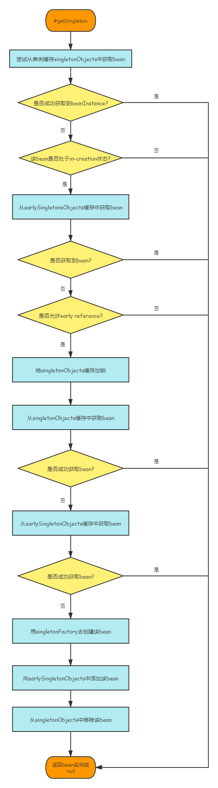

# SpringFramework源码解析——AbstractBeanFactory

<!-- vscode-markdown-toc -->
* 1. [前言](#)
* 2. [#getBean](#getBean)
* 3. [#doGetBean(很重要)](#doGetBean)
* 4. [#transaformedBeanName从Bean的别名去获取原始名称](#transaformedBeanNameBean)
* 5. [#getSingleton尝试从单例缓存中去获取Bean(重要)](#getSingletonBean)
* 6. [#getSingleton如何解决循环依赖问题(todo)](#getSingletontodo)
* 7. [#markBeanAsCreated双重校验锁标注Bean创建完成](#markBeanAsCreatedBean)
* 8. [#isSingleton检查beanName对应的Bean是否为单例](#isSingletonbeanNameBean)

<!-- vscode-markdown-toc-config
	numbering=true
	autoSave=true
	/vscode-markdown-toc-config -->
<!-- /vscode-markdown-toc -->

##  1. <a name=''></a>前言

Spring在**容器初始化**阶段，将配置文件中的配置信息通过ResourceLoader和Resource等组件读取，封装，之后容器会对加载后的配置信息进行解析，验证，最后将解析后的信息封装在BeanDefinition中，再注册进BeanDefinitionRegistry，进而存储到Spring容器里。

经过容器初始化阶段后，应用程序中定义的 bean 信息已经全部加载到系统中了，但是此时Bean的存储形式也只是BeanDefinition。只有我们显示调用`#getBean` 方法的时候，才会触发bean的加载。

在前面分析[BeanFactory接口架构](https://github.com/OxCaffee/Backend-Java-Note/blob/main/doc/Spring/SpringFramework/BeanFactory%E6%9E%B6%E6%9E%84%E6%8E%A5%E5%8F%A3%E5%88%86%E6%9E%90.md)中可以看到，BeanFactory顶级接口声明了`getBean` 方法，因此只要是Spring容器类型就一定会有这个方法。

我们再把BeanFactory的架构图放在这里:

<div align=center></div>

可以看到AbstractBeanFactory是其他BeanFactory的抽象基类，很多接口方法的原始定义都可以在这里找到。

##  2. <a name='getBean'></a>#getBean

AbstractBeanFactory对于所有的`#getBean` 操作，都进一步执行了`#doGetBean` 这个通用方法。

- `name` ：要获取 Bean 的名字
- `requiredType` ：要获取 bean 的类型
- `args` ：创建 Bean 时传递的参数。这个参数仅限于创建 Bean 时使用。
- `typeCheckOnly` ：是否为类型检查。

```java
	@Override
	public Object getBean(String name) throws BeansException {
		return doGetBean(name, null, null, false);
	}

	@Override
	public <T> T getBean(String name, Class<T> requiredType) throws BeansException {
		return doGetBean(name, requiredType, null, false);
	}

	@Override
	public Object getBean(String name, Object... args) throws BeansException {
		return doGetBean(name, null, args, false);
	}

	public <T> T getBean(String name, @Nullable Class<T> requiredType, @Nullable Object... args)
			throws BeansException {

		return doGetBean(name, requiredType, args, false);
	}
```

##  3. <a name='doGetBean'></a>#doGetBean(很重要)

```java
	protected <T> T doGetBean(
			String name, @Nullable Class<T> requiredType, @Nullable Object[] args, boolean typeCheckOnly)
			throws BeansException {

		//获取规范化的bean名称，包括对factory bean的前缀解耦和bean别名的处置
		String beanName = transformedBeanName(name);

		//要返回的bean实例
		Object beanInstance;

		// Eagerly check singleton cache for manually registered singletons.
		//从缓存或者实例工厂中获取bean
		Object sharedInstance = getSingleton(beanName);
		if (sharedInstance != null && args == null) {
			if (logger.isTraceEnabled()) {
				if (isSingletonCurrentlyInCreation(beanName)) {
					logger.trace("Returning eagerly cached instance of singleton bean '" + beanName +
							"' that is not fully initialized yet - a consequence of a circular reference");
				}
				else {
					logger.trace("Returning cached instance of singleton bean '" + beanName + "'");
				}
			}
			//完成FactoryBean的相关处理，用来获取FactoryBean的处理结果
			beanInstance = getObjectForBeanInstance(sharedInstance, name, beanName, null);
		}

		else {
			//Spring只解决单例模式下的循环依赖，如果原型模式下存在循环依赖则会抛出异常
			if (isPrototypeCurrentlyInCreation(beanName)) {
				throw new BeanCurrentlyInCreationException(beanName);
			}

			// 如果当前容器没有找到，就从父容器中查找
			BeanFactory parentBeanFactory = getParentBeanFactory();
			if (parentBeanFactory != null && !containsBeanDefinition(beanName)) {
				// 没有找到，向上找父容器
				String nameToLookup = originalBeanName(name);
				//如果父容器也是AbstractBeanFactory，直接调用父容器的doGetBean
				if (parentBeanFactory instanceof AbstractBeanFactory) {
					return ((AbstractBeanFactory) parentBeanFactory).doGetBean(
							nameToLookup, requiredType, args, typeCheckOnly);
				}
				else if (args != null) {
					//如果父容器不是AbstractBeanFactory类型，那么doGetBean不一定存在，就需要调用getBean
					return (T) parentBeanFactory.getBean(nameToLookup, args);
				}
				else if (requiredType != null) {
					// 没有args参数， 但是requireType不为空，继续尝试获取bean
					return parentBeanFactory.getBean(nameToLookup, requiredType);
				}
				else {
					//至此args, requireType均为空，只通过名字查找
					return (T) parentBeanFactory.getBean(nameToLookup);
				}
			}

			//如果不需要进行类型检查，直接标注此bean为“完成创建”状态
			if (!typeCheckOnly) {
				markBeanAsCreated(beanName);
			}

			//开启spring bean的创建过程，并标注当前beanName以检测性能
			StartupStep beanCreation = this.applicationStartup.start("spring.beans.instantiate")
					.tag("beanName", name);
			try {
				if (requiredType != null) {
					beanCreation.tag("beanType", requiredType::toString);
				}

				//主要是将 GenericBeanDefinition统一转换成RootDefinition
				RootBeanDefinition mbd = getMergedLocalBeanDefinition(beanName);
				checkMergedBeanDefinition(mbd, beanName, args);

				// Guarantee initialization of beans that the current bean depends on.
				// 确保当前bean所依赖的bean能够被初始化
				String[] dependsOn = mbd.getDependsOn();
				if (dependsOn != null) {
					for (String dep : dependsOn) {
						//本来是beanName依赖dep，但是这一步如果是dep依赖beanName，就构成了循环依赖
						//出现循环依赖就要抛出异常
						if (isDependent(beanName, dep)) {
							throw new BeanCreationException(mbd.getResourceDescription(), beanName,
									"Circular depends-on relationship between '" + beanName + "' and '" + dep + "'");
						}
						//注册bean之间的依赖关系
						registerDependentBean(dep, beanName);

						try {
							//获取依赖的bean
							getBean(dep);
						}
						catch (NoSuchBeanDefinitionException ex) {
							//如果获取不到，就抛出异常，依赖的Bean不存在
							throw new BeanCreationException(mbd.getResourceDescription(), beanName,
									"'" + beanName + "' depends on missing bean '" + dep + "'", ex);
						}
					}
				}

				// RootDefinition为单例模式
				if (mbd.isSingleton()) {
					sharedInstance = getSingleton(beanName, () -> {
						try {
							return createBean(beanName, mbd, args);
						}
						catch (BeansException ex) {
							// Explicitly remove instance from singleton cache: It might have been put there
							// eagerly by the creation process, to allow for circular reference resolution.
							// Also remove any beans that received a temporary reference to the bean.
							// 显式从单例缓存中删除 Bean 实例
							// 因为单例模式下为了解决循环依赖，可能他已经存在了，所以销毁它
							destroySingleton(beanName);
							throw ex;
						}
					});
					// 从单例缓存中获取该beanInstance
					beanInstance = getObjectForBeanInstance(sharedInstance, name, beanName, mbd);
				}

				else if (mbd.isPrototype()) {
					// It's a prototype -> create a new instance.
					Object prototypeInstance = null;
					try {
						//原型模式下创建之前的操作，主要记录原型模式创建的个数和名称集合
						//并标注当前创建的beanInstance为in-creation状态
						beforePrototypeCreation(beanName);
						//创建bean
						prototypeInstance = createBean(beanName, mbd, args);
					}
					finally {
						//原型模式创建后的操作，将此beanInstance从in-creation状态中移除
						afterPrototypeCreation(beanName);
					}
					//尝试从原型缓存中获取beanInstance
					beanInstance = getObjectForBeanInstance(prototypeInstance, name, beanName, mbd);
				}

				else {
					//如果当前bean还有其他scope，比如web应用中的session等
					String scopeName = mbd.getScope();
					if (!StringUtils.hasLength(scopeName)) {
						throw new IllegalStateException("No scope name defined for bean ´" + beanName + "'");
					}
					Scope scope = this.scopes.get(scopeName);
					if (scope == null) {
						throw new IllegalStateException("No Scope registered for scope name '" + scopeName + "'");
					}
					try {
						//之后都是同样的操作了，只不过此时的缓存变成了scopeInstance缓存
						Object scopedInstance = scope.get(beanName, () -> {
							beforePrototypeCreation(beanName);
							try {
								return createBean(beanName, mbd, args);
							}
							finally {
								afterPrototypeCreation(beanName);
							}
						});
						beanInstance = getObjectForBeanInstance(scopedInstance, name, beanName, mbd);
					}
					catch (IllegalStateException ex) {
						throw new ScopeNotActiveException(beanName, scopeName, ex);
					}
				}
			}
			catch (BeansException ex) {
				//Startup标注
				beanCreation.tag("exception", ex.getClass().toString());
				beanCreation.tag("message", String.valueOf(ex.getMessage()));
				cleanupAfterBeanCreationFailure(beanName);
				throw ex;
			}
			finally {
				//bean创建过程结束
				beanCreation.end();
			}
		}

		//此时获取的bean可能类型不会匹配，因此进行相应的类型转换
		return adaptBeanInstance(name, beanInstance, requiredType);
	}
```

上面的实现逻辑很复杂，我们一个方法一个方法地捋一下。

##  4. <a name='transaformedBeanNameBean'></a>#transaformedBeanName从Bean的别名去获取原始名称

这个方法是为了获取bean的最原始的名称，因为一个bean可能会有别名(alias)。

```java
//AbstractBeanFactory.java	
	

protected String transformedBeanName(String name) {
    //BeanFactoryUtils.transformedBeanName()首先解耦factory bean prefix &， 然后将beanName放入缓存当中
	return canonicalName(BeanFactoryUtils.transformedBeanName(name));
}
```

```java
//AbstractBeanFactory.java

    public String canonicalName(String name) {
		String canonicalName = name;
		// Handle aliasing...
		String resolvedName;
		do {
         	//<1>
			resolvedName = this.aliasMap.get(canonicalName);
			if (resolvedName != null) {
				canonicalName = resolvedName;
			}
		}
		while (resolvedName != null);
		return canonicalName;
	}
```

上面`<1>`处的代码很有意思，为什么要一个循环？这就类似于树的数组表示，如果A的别名是B，B的别名是C，而C是真名(raw name)，那么不断地用K-V获取，就可以获取到最后的raw name。

所以上面看似是个循环算法，实际上是个递归算法。

##  5. <a name='getSingletonBean'></a>#getSingleton尝试从单例缓存中去获取Bean(重要)

实际上Spring容器中的Bean绝大多数都是单例模式(singleton)，这个设计模式想必也不陌生，可以说是面试中的重点了，一些Spring的面试题例如“你知道Spring中的设计模式有哪些？”等等，如果能把下面的源码讲清楚，那么一定是面试的加分项。

回到源码解析，`#getSingleton`是DefaultListableBeanRegistry当中的方法，源码如下：

```java
	protected Object getSingleton(String beanName, boolean allowEarlyReference) {

	    // <1>快速尝试获取该singleton bean
        // singletonObjects是singleton bean的一个缓存cache
        // 为什么首先从这里获取？因为Spring源码的实现是 先创建->存进缓存->在取出来返回
		Object singletonObject = this.singletonObjects.get(beanName);

		if (singletonObject == null && isSingletonCurrentlyInCreation(beanName)) {
			//<2>如果获取不到该singleton bean，并且该singleton在创建的过程中，尝试正在创建过程的bean缓存中获取
             // 至于为什么要这样分？等到后面我们理解了bean的声明周期lifecycle之后再回答 
			singletonObject = this.earlySingletonObjects.get(beanName);

			if (singletonObject == null && allowEarlyReference) {
				//<3>如果该bean也不在in-creation缓存中，且允许 提前引用(即允许引用还未创建完成的bean)
				synchronized (this.singletonObjects) {	// 对该单例缓存加锁lock(注意不是对 in-creation单例缓存加锁)
					// 继续尝试从该单例缓存中获取bean
					singletonObject = this.singletonObjects.get(beanName);
                      //如果仍然获取不到
					if (singletonObject == null) {
                          //再一次尝试从in-creation单例缓存中获取bean
						singletonObject = this.earlySingletonObjects.get(beanName);
                          //如果in-creation单例缓存还获取不到，就说明该bean既不在in-creation状态，也不在created状态
                          //那么只能直接创建
						if (singletonObject == null) {
                              //使用单例工厂创建bean
							ObjectFactory<?> singletonFactory = this.singletonFactories.get(beanName);
							if (singletonFactory != null) {
								singletonObject = singletonFactory.getObject();
                                   //in-creation单例缓存添加该bean，因为这个bean还需要一些后置化的操作
								this.earlySingletonObjects.put(beanName, singletonObject);
                                   //单例工厂中移除该beanFactory
								this.singletonFactories.remove(beanName);
							}
						}
					}
				}
			}
		}
		return singletonObject;
	}
```

上述过程可以描述为下面的流程图：

<div align=center></div>

##  6. <a name='getSingletontodo'></a>#getSingleton如何解决循环依赖问题(todo)

##  7. <a name='markBeanAsCreatedBean'></a>#markBeanAsCreated双重校验锁标注Bean创建完成

markBeanAsCreated用到了双重校验锁机制，来标注beanName对应的bean已经创建完成，其基本操作就是：

```java
	protected void markBeanAsCreated(String beanName) {
        //加锁前校验
		if (!this.alreadyCreated.contains(beanName)) {
            //加锁
			synchronized (this.mergedBeanDefinitions) {
                //加锁后校验
				if (!this.alreadyCreated.contains(beanName)) {
					// Let the bean definition get re-merged now that we're actually creating
					// the bean... just in case some of its metadata changed in the meantime.
                    //这一步的目的是重新合并bean的定义，防止bean的元数据被修改
					clearMergedBeanDefinition(beanName);
                    //将该bean添加进created缓存
					this.alreadyCreated.add(beanName);
				}
			}
		}
	}
```

##  8. <a name='isSingletonbeanNameBean'></a>#isSingleton检查beanName对应的Bean是否为单例

Spring是如何检查beanName对应的bean是否是单例的呢？

```java
	public boolean isSingleton(String name) throws NoSuchBeanDefinitionException {
        //获取bean的原始名称
		String beanName = transformedBeanName(name);

        //从单例缓存中获取bean
		Object beanInstance = getSingleton(beanName, false);
        //如果单例缓存中存在bean
		if (beanInstance != null) {
            //如果该单例bean是FactoryBean
			if (beanInstance instanceof FactoryBean) {
				return (BeanFactoryUtils.isFactoryDereference(name) || ((FactoryBean<?>) beanInstance).isSingleton());
			}
			else {
				return !BeanFactoryUtils.isFactoryDereference(name);
			}
		}

		// No singleton instance found -> check bean definition.
        //如果单例缓存中没有bean实例，那么该bean可能没有被创建
        //此时检查BeanDefinition
		BeanFactory parentBeanFactory = getParentBeanFactory();
		if (parentBeanFactory != null && !containsBeanDefinition(beanName)) {
			// 当前factory没有发现BeanDefinition，委托给父Factory
			return parentBeanFactory.isSingleton(originalBeanName(name));
		}

        //当前Factory查到definition
		RootBeanDefinition mbd = getMergedLocalBeanDefinition(beanName);

		// In case of FactoryBean, return singleton status of created object if not a dereference.
        //如果该BeanDefinition是单例
		if (mbd.isSingleton()) {
            //检查是否是factoryBean
			if (isFactoryBean(beanName, mbd)) {
                //如果factoryBean前缀解耦，那么是单例
				if (BeanFactoryUtils.isFactoryDereference(name)) {
					return true;
				}
                //获取factoryBean，检查该factoryBean是否是单例
				FactoryBean<?> factoryBean = (FactoryBean<?>) getBean(FACTORY_BEAN_PREFIX + beanName);
				return factoryBean.isSingleton();
			}
			else {
                //如果该beanName前缀没有&，说明不是factoryBean，只是普通的bean，直接返回该bean是否是单例
				return !BeanFactoryUtils.isFactoryDereference(name);
			}
		}
		else {
			return false;
		}
	}
```


