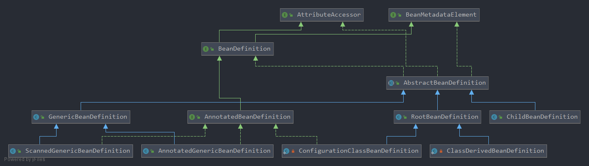

# SpringFramework源码解析——BeanDefinition

<!-- vscode-markdown-toc -->
* 1. [为什么需要BeanDefiniton](#BeanDefiniton)
* 2. [BeanDefintion家族的结构图](#BeanDefintion)
* 3. [顶级接口BeanDefinition](#BeanDefinition)
* 4. [BeanDefiniton抽象实现——AbstractBeanDefinition](#BeanDefinitonAbstractBeanDefinition)
* 5. [RootBeanDefinition,GenericBeanDefinition和ChildBeanDefinition](#RootBeanDefinitionGenericBeanDefinitionChildBeanDefinition)
* 6. [ScannedGenericBeanDefinition和AnnotatednGenericBeanDefinition](#ScannedGenericBeanDefinitionAnnotatednGenericBeanDefinition)

<!-- vscode-markdown-toc-config
	numbering=true
	autoSave=true
	/vscode-markdown-toc-config -->
<!-- /vscode-markdown-toc -->

##  1. <a name='BeanDefiniton'></a>为什么需要BeanDefiniton

BeanDefinition中一个很重要的概念，平常我们在编写代码的时候，都会先编写一个Class文件，然后当需要使用该Class的时候，执行new操作实例化一个对象Object，那么为什么Spring不直接用普通类对象创建我们的bean呢？因为普通类对象无法完成对bean的抽象，比如bean的作用域，bean的inject策略等等。 **在这种情况下，每一个class都是单独存在的，相互之间也许无关系，这就无法对所有的class进行统一的管理和操作，更无法控制每一个class的声明周期** 。在这种情况下，我们需要对普通Class对象进行进一步的包装，即包装成BeanDefintion，存储到我们的Spring容器当中。

有了上面大概的认识，我们就可以开启BeanDefintion的源码探索之旅了，注意： **我们在阅读的时候时刻记住:BeanDefinition是bean存储在Spring容器中的一种数据结构** 。

##  2. <a name='BeanDefintion'></a>BeanDefintion家族的结构图

<div align=center></div>

下面我们就顺着该结构图依次撸源码。

##  3. <a name='BeanDefinition'></a>顶级接口BeanDefinition

BeanDefintion是一个接口，声明如下:

```java
public interface BeanDefinition extends AttributeAccessor, BeanMetadataElement
```

可以看到BeanDefinition继承了两个接口，分别为：

* `AttributeAccessor`: 一种绑定和获取任意对象元数据的接口
* `BeanMetadataElement`: 一种获取包含配置信息的源对象的接口

在BeanDefiniton内部，声明了若干常量:

```java
//标识该bean的scope为singletone，即单例
String SCOPE_SINGLETON = ConfigurableBeanFactory.SCOPE_SINGLETON;
//标识该bean的scope为prototype，即原型模式，每次使用bean都会创建一个新的bean
String SCOPE_PROTOTYPE = ConfigurableBeanFactory.SCOPE_PROTOTYPE;

//标识该bean的角色是应用中的主要部分
int ROLE_APPLICATION = 0;
//标识该bean的角色是支持(外部)复杂配置的部分
int ROLE_SUPPORT = 1;
//标识该bean的角色是完全与用户无关，完全是应用内部的一部分
int ROLE_INFRASTRUCTURE = 2;

//该bean的父类名称
void setParentName(@Nullable String parentName);
@Nullable
String getParentName();

//设置该bean的类名称
void setBeanClassName(@Nullable String beanClassName);
@Nullable
String getBeanClassName();

//该bean的作用域
void setScope(@Nullable String scope);
@Nullable
String getScope();

//懒加载相关
void setLazyInit(boolean lazyInit);
boolean isLazyInit();

//该bean的依赖，也许有多个依赖，数组的形式表达
void setDependsOn(@Nullable String... dependsOn);
@Nullable
String[] getDependsOn();

//该bean是否是注入其他bean内部的一个后选择
//注意：这个boolean值仅仅影响“基于类型的注入”，对指定名称的注入并不影响
void setAutowireCandidate(boolean autowireCandidate);
boolean isAutowireCandidate();

//该bean在注入时是否优先
void setPrimary(boolean primary);
boolean isPrimary();

//调用指定工厂方法的bean的名称，@TODO 创建该bean的工厂bean名称
void setFactoryBeanName(@Nullable String factoryBeanName);
@Nullable
String getFactoryBeanName();

//指定工厂方法，如果没有或者没有参数指定，这个方法会调用构造器
void setFactoryMethodName(@Nullable String factoryMethodName);
@Nullable
String getFactoryMethodName();

//该bean构造器的参数值，内部以Map的方式存储
ConstructorArgumentValues getConstructorArgumentValues();
default boolean hasConstructorArgumentValues() {
	return !getConstructorArgumentValues().isEmpty();
}

//返回即将创建的bean实例的属性值
MutablePropertyValues getPropertyValues();
default boolean hasPropertyValues() {
	return !getPropertyValues().isEmpty();
}

//bean初始化方法名称
void setInitMethodName(@Nullable String initMethodName);
@Nullable
String getInitMethodName();

//销毁该bean的方法名称
void setDestroyMethodName(@Nullable String destroyMethodName);
@Nullable
String getDestroyMethodName();

//设置该bean的角色
void setRole(int role);
int getRole();


void setDescription(@Nullable String description);
@Nullable
String getDescription();


// Read-only attributes
	
//该Bean定义的可解析类型
ResolvableType getResolvableType();
boolean isSingleton();
boolean isPrototype();
boolean isAbstract();
@Nullable
String getResourceDescription();
@Nullable
BeanDefinition getOriginatingBeanDefinition();
```

上面就是BeanDefinition基本的定义，大概总结一下BeanDefinition的基本属性:

1. 作用域scope: singleton或prototype
2. 角色：application/support/infras

接下来我们考察BeanDefiniton的抽象实现AbstractBeanDefinition

##  4. <a name='BeanDefinitonAbstractBeanDefinition'></a>BeanDefiniton抽象实现——AbstractBeanDefinition

AbstractBeanDefinition是BeanDefiniton的抽象实现，也是其他BeanDefinition具体实现的基类，定义了BeanDefinition的默认行为。

首先先考察AbstractBeanDefinition的重要常量：

```java
	//默认作用域为""表明是singleton单例
	public static final String SCOPE_DEFAULT = "";

	//表明没有外部bean的注入
	public static final int AUTOWIRE_NO = AutowireCapableBeanFactory.AUTOWIRE_NO;

	//表明依据bean的名称注入
	public static final int AUTOWIRE_BY_NAME = AutowireCapableBeanFactory.AUTOWIRE_BY_NAME;

	//表明依据bean的类型注入
	public static final int AUTOWIRE_BY_TYPE = AutowireCapableBeanFactory.AUTOWIRE_BY_TYPE;

	//表明构造器注入
	public static final int AUTOWIRE_CONSTRUCTOR = AutowireCapableBeanFactory.AUTOWIRE_CONSTRUCTOR;

	//自动注入
	public static final int AUTOWIRE_AUTODETECT = AutowireCapableBeanFactory.AUTOWIRE_AUTODETECT;

	//不进行依赖检查
	public static final int DEPENDENCY_CHECK_NONE = 0;

	//进行引用检查
	public static final int DEPENDENCY_CHECK_OBJECTS = 1;

	//进行简单属性检查
	public static final int DEPENDENCY_CHECK_SIMPLE = 2;

	//既进行引用检查又进行全部属性的检查
	public static final int DEPENDENCY_CHECK_ALL = 3;

	//指示容器应该尝试推断(infer)bean的销毁方法名而不是指定方法名
	public static final String INFER_METHOD = "(inferred)";
```

除了常量之外，还增设了一些附加的属性:

```java
	//该bean对应的class
	@Nullable
	private volatile Object beanClass;

	//默认scope，空""表示singleton，即单例模式
	@Nullable
	private String scope = SCOPE_DEFAULT;

	//抽象标志，默认false @TODO 这个还没有搞清
	private boolean abstractFlag = false;

	//是否进行bean的懒加载
	@Nullable
	private Boolean lazyInit;

	//默认不注入
	private int autowireMode = AUTOWIRE_NO;

	//默认不进行依赖检查
	private int dependencyCheck = DEPENDENCY_CHECK_NONE;

	@Nullable
	private String[] dependsOn;

	//默认是注入其他bean的候选者candidate @TODO
	private boolean autowireCandidate = true;

	//默认不优先注入
	private boolean primary = false;

	//注入的修饰符 @TODO
	private final Map<String, AutowireCandidateQualifier> qualifiers = new LinkedHashMap<>();

	@Nullable
	private Supplier<?> instanceSupplier;

	private boolean nonPublicAccessAllowed = true;

	private boolean lenientConstructorResolution = true;

	@Nullable
	private String factoryBeanName;

	@Nullable
	private String factoryMethodName;

	@Nullable
	private ConstructorArgumentValues constructorArgumentValues;

	@Nullable
	private MutablePropertyValues propertyValues;

	private MethodOverrides methodOverrides = new MethodOverrides();

	@Nullable
	private String initMethodName;

	@Nullable
	private String destroyMethodName;

	private boolean enforceInitMethod = true;

	private boolean enforceDestroyMethod = true;

	private boolean synthetic = false;

	//默认bean role是application级别的
	private int role = BeanDefinition.ROLE_APPLICATION;

	@Nullable
	private String description;

	@Nullable
	private Resource resource;
```

除此之外，我们重点考察**BeanDefintion的默认注入行为** ,即`#getResolvedAutowireMode` 方法

```java
	public int getResolvedAutowireMode() {
		if (this.autowireMode == AUTOWIRE_AUTODETECT) {
			// Work out whether to apply setter autowiring or constructor autowiring.
			// If it has a no-arg constructor it's deemed to be setter autowiring,
			// otherwise we'll try constructor autowiring.
			Constructor<?>[] constructors = getBeanClass().getConstructors();
			for (Constructor<?> constructor : constructors) {
				if (constructor.getParameterCount() == 0) {
					return AUTOWIRE_BY_TYPE;
				}
			}
			return AUTOWIRE_CONSTRUCTOR;
		}
		else {
			return this.autowireMode;
		}
	}
```

`#getResolvedAutowireMode` 执行逻辑如下:

* 检查是否是自动注入`AUTOWIRE_AUTODETECT`
  * 是自动注入：判断该bean构造器是否是有参构造器
    * 如果是有参构造器，执行构造器注入
    * 如果没有参数，执行类型注入
  * 不是自动注入，只能是`TYPE` 和 `CONSTRUCTOR` 两种注入模式

还有一个非常重要的方法，就是`equals` ，即如何判断两个BeanDefinition相等：

```java
	public boolean equals(@Nullable Object other) {
        //同一对象，相等
		if (this == other) {
			return true;
		}
        //不同类，不相等
		if (!(other instanceof AbstractBeanDefinition)) {
			return false;
		}
        //不是同一对象，但是属性全部相等
		AbstractBeanDefinition that = (AbstractBeanDefinition) other;
		return (ObjectUtils.nullSafeEquals(getBeanClassName(), that.getBeanClassName()) &&
				ObjectUtils.nullSafeEquals(this.scope, that.scope) &&
				this.abstractFlag == that.abstractFlag &&
				this.lazyInit == that.lazyInit &&
				this.autowireMode == that.autowireMode &&
				this.dependencyCheck == that.dependencyCheck &&
				Arrays.equals(this.dependsOn, that.dependsOn) &&
				this.autowireCandidate == that.autowireCandidate &&
				ObjectUtils.nullSafeEquals(this.qualifiers, that.qualifiers) &&
				this.primary == that.primary &&
				this.nonPublicAccessAllowed == that.nonPublicAccessAllowed &&
				this.lenientConstructorResolution == that.lenientConstructorResolution &&
				equalsConstructorArgumentValues(that) &&
				equalsPropertyValues(that) &&
				ObjectUtils.nullSafeEquals(this.methodOverrides, that.methodOverrides) &&
				ObjectUtils.nullSafeEquals(this.factoryBeanName, that.factoryBeanName) &&
				ObjectUtils.nullSafeEquals(this.factoryMethodName, that.factoryMethodName) &&
				ObjectUtils.nullSafeEquals(this.initMethodName, that.initMethodName) &&
				this.enforceInitMethod == that.enforceInitMethod &&
				ObjectUtils.nullSafeEquals(this.destroyMethodName, that.destroyMethodName) &&
				this.enforceDestroyMethod == that.enforceDestroyMethod &&
				this.synthetic == that.synthetic &&
				this.role == that.role &&
				super.equals(other));
	}
```

##  5. <a name='RootBeanDefinitionGenericBeanDefinitionChildBeanDefinition'></a>RootBeanDefinition,GenericBeanDefinition和ChildBeanDefinition

**从spring2.5开始，Spring一开始都是使用GenericBeanDefinition类保存Bean的相关信息，在需要时，在将其转换为其他的BeanDefinition类型**

GenericBeanDefinition的patentName属性指定了当前类的父类，最重要的是它实现了parentName属性的setter、getter函数，RootBeanDefinition没有parentName属性，对应的getter函数只是返回null，setter函数不提供赋值操作

也就是说RootBeanDefinition不提供继承相关的操作，但是初始化时使用的是RootBeanDefinition，那父类的性质如何体现？

**这里要注意一点，子类会覆盖父类中相同的属性，所以Spring会首先初始化父类的RootBeanDefinition，然后根据子类的GenericBeanDefinition覆盖父类中相应的属性，最终获得子类的RootBeanDefinition，这个比较巧妙，不需要使用两个对象来体现父类与子类的关系。**

* RootBeanDefinition可以作为其他BeanDefinition的父BeanDefinition，但是不能作为其他BeanDefinition的子类，可以单独存在
* ChildBeanDefinition只能作为其他BeanDefinition的子BeanDefinition，但是不能作为其他BeanDefinition的父类，并且不能单独存在

##  6. <a name='ScannedGenericBeanDefinitionAnnotatednGenericBeanDefinition'></a>ScannedGenericBeanDefinition和AnnotatednGenericBeanDefinition

顾名思义，被扫描注册的bean和被注解声明的bean

## 合并了Bean的定义——MergedBeanDefinition

在Spring中,关于bean定义,其Java建模模型是接口BeanDefinition, 其变种有RootBeanDefinition，ChildBeanDefinition，还有GenericBeanDefinition，AnnotatedGenericBeanDefinition,ScannedGenericBeanDefinition等等。这些概念模型抽象了不同的关注点。关于这些概念模型，除了有概念，也有相应的Java建模模型，甚至还有通用的实现部分AbstractBeanDefinition。但事实上，关于BeanDefinition，还有一个概念也很重要，这就是MergedBeanDefinition(中文也许应该翻译成"合并了的bean定义"?),但这个概念并没有相应的Java模型对应。但是它确实存在，并且Spring专门为它提供了一个生命周期回调定义接口MergedBeanDefinitionPostProcessor用于扩展。

### MergedBeanDefinition如何生成的

我们先从代码看一个`MergedBeanDefinition`是怎么生成的 ? 下面是类`AbstractBeanFactory`中`bean`获取方法`doGetBean()`的伪代码 :

```java
protected <T> T doGetBean(final String name, @Nullable final Class<T> requiredType,
			@Nullable final Object[] args, boolean typeCheckOnly) throws BeansException {
	// ...
	// 这里根据bean名称获取MergedBeanDefinition，结果类型是RootBeanDefinition 
	final RootBeanDefinition mbd = getMergedLocalBeanDefinition(beanName);
	// ...		
	createBean(beanName, mbd, args);
	
	// ...
}
```

从上面代码可见，通过方法`getMergedLocalBeanDefinition()`，一个`RootBeanDefinition mbd`根据`bean`名称生成了。我们进而跟踪`getMergedLocalBeanDefinition`的实现。如下 :

```java
	/**
	 * Return a merged RootBeanDefinition, traversing the parent bean definition
	 * if the specified bean corresponds to a child bean definition.
	 * @param beanName the name of the bean to retrieve the merged definition for
	 * @return a (potentially merged) RootBeanDefinition for the given bean
	 * @throws NoSuchBeanDefinitionException if there is no bean with the given name
	 * @throws BeanDefinitionStoreException in case of an invalid bean definition
	 */
	protected RootBeanDefinition getMergedLocalBeanDefinition(String beanName) 
	throws BeansException {
		// Quick check on the concurrent map first, with minimal locking.
		RootBeanDefinition mbd = this.mergedBeanDefinitions.get(beanName);
		if (mbd != null) {
			return mbd;
		}
		return getMergedBeanDefinition(beanName, getBeanDefinition(beanName));
	}

	/**
	 * Return a RootBeanDefinition for the given top-level bean, by merging with
	 * the parent if the given bean's definition is a child bean definition.
	 * @param beanName the name of the bean definition
	 * @param bd the original bean definition (Root/ChildBeanDefinition)
	 * @return a (potentially merged) RootBeanDefinition for the given bean
	 * @throws BeanDefinitionStoreException in case of an invalid bean definition
	 */	
	protected RootBeanDefinition getMergedBeanDefinition(String beanName, BeanDefinition bd)
			throws BeanDefinitionStoreException {

		return getMergedBeanDefinition(beanName, bd, null);
	}

	/**
	 * Return a RootBeanDefinition for the given bean, by merging with the
	 * parent if the given bean's definition is a child bean definition.
	 * @param beanName the name of the bean definition
	 * @param bd the original bean definition (Root/ChildBeanDefinition)
	 * @param containingBd the containing bean definition in case of inner bean,
	 * or null in case of a top-level bean
	 * @return a (potentially merged) RootBeanDefinition for the given bean
	 * @throws BeanDefinitionStoreException in case of an invalid bean definition
	 */		
	protected RootBeanDefinition getMergedBeanDefinition(
			String beanName, BeanDefinition bd, @Nullable BeanDefinition containingBd)
			throws BeanDefinitionStoreException {

		synchronized (this.mergedBeanDefinitions) {
			// 准备一个RootBeanDefinition变量引用，用于记录要构建和最终要返回的BeanDefinition，
			// 这里根据上下文不难猜测 mbd 应该就是 mergedBeanDefinition 的缩写。
			RootBeanDefinition mbd = null;

			// Check with full lock now in order to enforce the same merged instance.
			if (containingBd == null) {
				mbd = this.mergedBeanDefinitions.get(beanName);
			}

			if (mbd == null) {
				if (bd.getParentName() == null) {
					// bd不是一个ChildBeanDefinition的情况,换句话讲，这 bd应该是 :
					// 1. 一个独立的 GenericBeanDefinition 实例，parentName 属性为null
					// 2. 或者是一个 RootBeanDefinition 实例，parentName 属性为null
					// 此时mbd直接使用一个bd的复制品
					// Use copy of given root bean definition.
					if (bd instanceof RootBeanDefinition) {						
						mbd = ((RootBeanDefinition) bd).cloneBeanDefinition();
					}
					else {
						mbd = new RootBeanDefinition(bd);
					}
				}
				else {
					// bd是一个ChildBeanDefinition的情况,
					// 这种情况下，需要将bd和其parent bean definition 合并到一起，
					// 形成最终的 mbd
					// 下面是获取bd的 parent bean definition 的过程，最终结果记录到 pbd，
					// 并且可以看到该过程中递归使用了getMergedBeanDefinition(), 为什么呢?
					// 因为 bd 的 parent bd 可能也是个ChildBeanDefinition，所以该过程
					// 需要递归处理
					// Child bean definition: needs to be merged with parent.
					BeanDefinition pbd;
					try {
						String parentBeanName = transformedBeanName(bd.getParentName());
						if (!beanName.equals(parentBeanName)) {
							pbd = getMergedBeanDefinition(parentBeanName);
						}
						else {
							BeanFactory parent = getParentBeanFactory();
							if (parent instanceof ConfigurableBeanFactory) {
								pbd = ((ConfigurableBeanFactory) 
									parent).getMergedBeanDefinition(parentBeanName);
							}
							else {
								throw new NoSuchBeanDefinitionException(parentBeanName,
										"Parent name '" + parentBeanName + 
										"' is equal to bean name '" + beanName +
							"': cannot be resolved without an AbstractBeanFactory parent");
							}
						}
					}
					catch (NoSuchBeanDefinitionException ex) {
						throw new BeanDefinitionStoreException(
							bd.getResourceDescription(), beanName,
								"Could not resolve parent bean definition '" + 
								bd.getParentName() + "'", ex);
					}
					// Deep copy with overridden values.
					// 现在已经获取 bd 的parent bd到pbd，从上面的过程可以看出，这个pbd
					// 也是已经"合并"过的。
					// 这里根据pbd创建最终的mbd，然后再使用bd覆盖一次，
					// 这样就相当于mbd来自两个BeanDefinition:
					// 当前 BeanDefinition 及其合并的("Merged")双亲 BeanDefinition,
					// 然后mbd就是针对当前bd的一个MergedBeanDefinition(合并的BeanDefinition)了。
					mbd = new RootBeanDefinition(pbd);
					mbd.overrideFrom(bd);
				}

				// Set default singleton scope, if not configured before.
				if (!StringUtils.hasLength(mbd.getScope())) {
					mbd.setScope(RootBeanDefinition.SCOPE_SINGLETON);
				}

				// A bean contained in a non-singleton bean cannot be a singleton itself.
				// Let's correct this on the fly here, since this might be the result of
				// parent-child merging for the outer bean, in which case the original 
				// inner bean
				// definition will not have inherited the merged outer bean's singleton status.
				if (containingBd != null && !containingBd.isSingleton() && mbd.isSingleton()) {
					mbd.setScope(containingBd.getScope());
				}

				// Cache the merged bean definition for the time being
				// (it might still get re-merged later on in order to pick up metadata changes)
				if (containingBd == null && isCacheBeanMetadata()) {
					this.mergedBeanDefinitions.put(beanName, mbd);
				}
			}

			return mbd;
		}
	}
```

从上面的`MergedBeanDefinition`的获取过程可以看出，一个`MergedBeanDefinition`其实就是一个"合并了的BeanDefinition"，最终以 **`RootBeanDefinition`** 的类型存在。

### MergedBeanDefinition的总结

综上可见，一个MergedBeanDefinition是这样一个载体:

* 根据原始BeanDefinition及其可能存在的双亲BeanDefinition中的bean定义信息"合并"而得来的一个RootBeanDefinition；
* 每个Bean的创建需要的是一个MergedBeanDefinition，也就是需要基于原始BeanDefinition及其双亲BeanDefinition信息得到一个信息"合并"之后的BeanDefinition；
* Spring框架同时提供了一个机会给框架其他部分，或者开发人员用于在bean创建过程中，MergedBeanDefinition生成之后，bean属性填充之前，对该bean和该MergedBeanDefinition做一次回调，相应的回调接口是MergedBeanDefinitionPostProcessor。
* MergedBeanDefinition没有相应的Spring建模，它是处于一个内部使用目的合并自其它BeanDefinition对象，其具体对象所使用的实现类类型是RootBeanDefinition。

