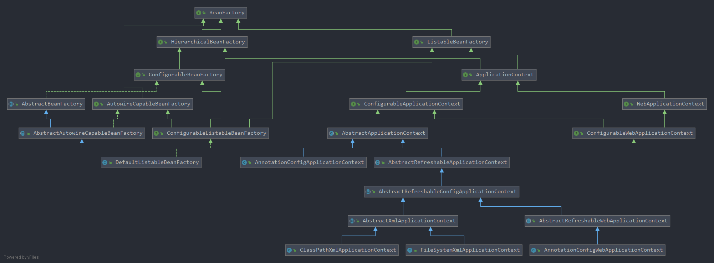

# SpringFramework源码解析——BeanFactory架构接口分析

## BeanFactory架构UML图

<div align=center></div>

* 顶级接口BeanFactory：提供了有关bean的一些基本操作。 **注意：创建bean的方法并不在此接口中**
* HierarchicalBeanFactory：为BeanFactory赋予了层级关系，即`getParentBeanFactory` 
* ListableBeanFactory：增加了可以枚举其中bean的接口
* ConfigurableBeanFactory：**注意，如果没有这个接口，那么BeanFactory就只是一个bean的管理中心，不是配置中心** 。该接口为BeanFactory提供了一些配置选项
* ApplicationContext：可以说这是我们现在最常使用的类型了
* AutowireCapableBeanFactory：为bean的注入提供了操作接口

## 什么是BeanFactory?

Spring源码中对BeanFactory的定义是这样的:

```markdown
//BeanFactory是访问Spring中bean容器的核心接口
The root interface for accessing a Spring bean container.

//BeanFactory的实现类是含有若干bean定义的对象，即BeanFactory就是一个个容器
This interface is implemented by objects that hold a number of bean definitions.

//BeanFactory是应用组件的注册中心，也是配置中心
The point of this approach is that the BeanFactory is a central registry
of application components, and centralizes configuration of application components

//Bean Factory的实现类应该尽可能支持标准的bean声明周期接口
Bean factory implementations should support the standard bean lifecycle interfaces
as far as possible.
```

BeanFactory源码中定义了如下常量：

```java
//如果myJndiObject是一个FactoryBean，那么 &myJndiObject会返回这个Factory，而不是该Factory返回的bean
String FACTORY_BEAN_PREFIX = "&";
```

BeanFactory中定义了如下方法：

```java
//BeanFactory.java

//获取bean的方法
<T> T getBean(String name, Class<T> requiredType) throws BeansException;
Object getBean(String name, Object... args) throws BeansException;
<T> T getBean(Class<T> requiredType) throws BeansException;
<T> T getBean(Class<T> requiredType, Object... args) throws BeansException;

//获取bean的提供者
<T> ObjectProvider<T> getBeanProvider(Class<T> requiredType);
<T> ObjectProvider<T> getBeanProvider(ResolvableType requiredType);

//判断bean是否存在在该容器当中
//	1. 如果name是别名，转换成真名查询
//	2. 如果factory具有层级接口hierarchical，当前factory查询不到会递交父factory查询
//	3. 只要name符合factory中singleton类型的bean名称，直接返回true
boolean containsBean(String name);

boolean isSingleton(String name) throws NoSuchBeanDefinitionException;
boolean isPrototype(String name) throws NoSuchBeanDefinitionException;

//bean类型的判断
boolean isTypeMatch(String name, ResolvableType typeToMatch) throws NoSuchBeanDefinitionException;
boolean isTypeMatch(String name, Class<?> typeToMatch) throws NoSuchBeanDefinitionException;

//获取类型
Class<?> getType(String name) throws NoSuchBeanDefinitionException;
Class<?> getType(String name, boolean allowFactoryBeanInit) throws NoSuchBeanDefinitionException;

//获取给定bean名称的bean的别名集合
String[] getAliases(String name);
```

通过上面的方法看到，BeanFactory作为顶级接口，实际上只提供了一些关于bean的**访问接口** 。并没有提供bean的诸如：创建，配置，销毁等等方法。而这些功能，需要BeanFactory的实现类或者派生接口来提供。

## HierarchicalBeanFactory

HierarchicalBeanFactory为BeanFactory之间建立了父子关系：

```java
BeanFactory getParentBeanFactory();
```

通过`getParentBeanFactory` 可以获得该BeanFactory的父工厂。

```java
boolean containesLocalBean(String name);
```

`containsLocalBean` **判断当前BeanFactory是否含有指定bean，当查找不到时不会向上层级查询** 。

## ConfigurableBeanFactory

ConfigurableBeanFactory为BeanFactory提供了配置bean的接口，这个接口被绝大多数的bean factory所实现。并提供了一系列的配置方法：

```java
//为bean提供了类加载器，默认类加载器为 thread-context-class-loader
void setBeanClassLoader(@Nullable ClassLoader beanClassLoader);
ClassLoader getBeanClassLoader();

//指定一个临时的(temporary)类加载器，目的是为了类型匹配，默认的NONE
//这个临时类加载器只有在load-time weaving(加载时织入)才会被显式指定
//为了确保实际的bean能够被懒加载
//一旦BeanFactory完成了启动阶段，临时加载器将会被移除
void setTempClassLoader(@Nullable ClassLoader tempClassLoader);
ClassLoader getTempClassLoader();

//是否缓存bean的元数据信息
void setCacheBeanMetadata(boolean cacheBeanMetadata);
boolean isCacheBeanMetadata();

//我们在配置bean的时候，经常会使用表达式，例如#{} EL表达式，解析器负责解析这些表达式，并转换为实际的值
void setBeanExpressionResolver(@Nullable BeanExpressionResolver resolver);
BeanExpressionResolver getBeanExpressionResolver();

//JavaBean PropertyEditors的替换，用于转换属性值
void setConversionService(@Nullable ConversionService conversionService);
ConversionService getConversionService();

//所有bean创建过程的通用PropertyEditorRegister
void addPropertyEditorRegistrar(PropertyEditorRegistrar registrar);

//为给定类型的所有属性注册给定的自定义属性编辑器
void registerCustomEditor(Class<?> requiredType, Class<? extends PropertyEditor> propertyEditorClass);

void copyRegisteredEditorsTo(PropertyEditorRegistry registry);
void setTypeConverter(TypeConverter typeConverter);
TypeConverter getTypeConverter();
void addEmbeddedValueResolver(StringValueResolver valueResolver);
boolean hasEmbeddedValueResolver();
String resolveEmbeddedValue(String value);
void addBeanPostProcessor(BeanPostProcessor beanPostProcessor);
int getBeanPostProcessorCount();
void registerScope(String scopeName, Scope scope);
String[] getRegisteredScopeNames();
Scope getRegisteredScope(String scopeName);
void setApplicationStartup(ApplicationStartup applicationStartup);
AccessControlContext getAccessControlContext();
void copyConfigurationFrom(ConfigurableBeanFactory otherFactory);
void registerAlias(String beanName, String alias) throws BeanDefinitionStoreException;
void resolveAliases(StringValueResolver valueResolver);
BeanDefinition getMergedBeanDefinition(String beanName) throws NoSuchBeanDefinitionException;
boolean isFactoryBean(String name) throws NoSuchBeanDefinitionException;
void setCurrentlyInCreation(String beanName, boolean inCreation);
boolean isCurrentlyInCreation(String beanName);
void registerDependentBean(String beanName, String dependentBeanName);
String[] getDependentBeans(String beanName);
String[] getDependenciesForBean(String beanName);
void destroyBean(String beanName, Object beanInstance);
void destroyScopedBean(String beanName);
void destroySingletons();
```

## ApplicationContext

ApplicationContext是应用配置的核心接口。当应用启动的时候是只读的，但如果实现类支持这一点，则可能会重新加载。

ApplicationContext提供了如下的功能:

* 从ListableBeanFactory继承而来的能访问应用组件的接口方法
* 从ResourceLoader继承而来的以通用的方式加载文件资源的方法
* 从ApplicationEventPublisher继承而来的注册监听器的方法
* 从MessageSource继承而来的国际化能力
* ApplicationContext的层级性质赋予了它一个应用仅仅需要一个parent context，而每一个组件都有自己的child context
* 管理bean生命周期的能力
* ApplicationContext同样也会检测和调用ApplicationContextAware，ResourceLoaderAware，ApplicationEventPublisherAware，MessageSourceAware等bean

下面看看ApplicationContext的源码：

```java
//ApplicationContext.java

String getId();
String getApplicationName();
String getDisplayName();
long getStartupDate();
ApplicationContext getParent();

//思考：这里并不是直接继承AutowireCapableBeanFactory接口而是选择内置，为什么？
//本人猜测，可能是为了不同的ApplicationContext有不同的行为，更灵活
AutowireCapableBeanFactory getAutowireCapableBeanFactory() throws IllegalStateException;
```

## ConfigurableListableBeanFactory

ConfigurableListableBeanFactory继承了ListableBeanFactory,  AutowireCapableBeanFactory, ConfigurableBeanFactory。同时增加了一些分析和修改BeanDefinition的方法以及初始化那些不需要lazy-init的singleton bean。

```java
void ignoreDependencyType(Class<?> type);
void ignoreDependencyInterface(Class<?> ifc);

void registerResolvableDependency(Class<?> dependencyType, @Nullable Object autowiredValue);

//确定指定的bean是否有资格作为自动装配候选bean，将其注入到声明匹配类型依赖的其他bean中。
boolean isAutowireCandidate(String beanName, DependencyDescriptor descriptor)
			throws NoSuchBeanDefinitionException;

...
```

## 总结

至此，大致的BeanFactory UML中的接口分析就完成了，仔细看看UML图，会发现BeanFactory顶级接口向下分化成了两大派系，一大派系就是``XxxBeanFactory` ，一大派系是`XxxxApplicationContext` 。这也是面试中的重点，面试官经常会问到BeanFactory和ApplicationContext有什么区别，鉴于要分析的源码太多，篇幅过长，关于这两大派系我们后面继续分析。

