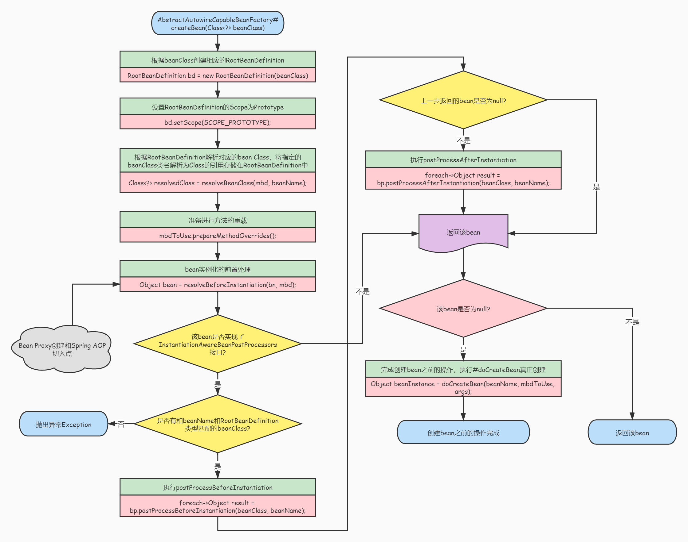
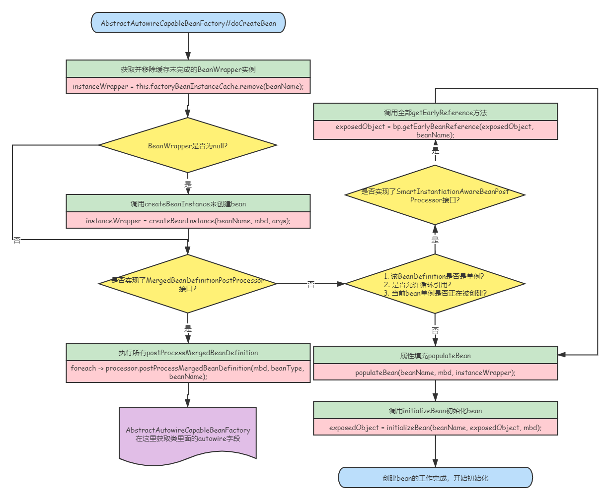

# SpringFramework源码解析——Bean的声明周期源码+图解

## Bean的获取

### 流程图

<div align=center></div>

### AbstractBeanFactory#doGetBean

```java
//AbstractBeanFactory.java
	protected <T> T doGetBean(
			String name, @Nullable Class<T> requiredType, @Nullable Object[] args, boolean typeCheckOnly)
			throws BeansException {

		//获取规范化的bean名称，包括对factory bean的前缀解耦和bean别名的处置
		String beanName = transformedBeanName(name);

		//要返回的bean实例
		Object beanInstance;

		// Eagerly check singleton cache for manually registered singletons.
		//从缓存或者实例工厂中获取bean
		Object sharedInstance = getSingleton(beanName);
		if (sharedInstance != null && args == null) {
			if (logger.isTraceEnabled()) {
				if (isSingletonCurrentlyInCreation(beanName)) {
					logger.trace("Returning eagerly cached instance of singleton bean '" + beanName +
							"' that is not fully initialized yet - a consequence of a circular reference");
				}
				else {
					logger.trace("Returning cached instance of singleton bean '" + beanName + "'");
				}
			}
			//完成FactoryBean的相关处理，用来获取FactoryBean的处理结果
			beanInstance = getObjectForBeanInstance(sharedInstance, name, beanName, null);
		}

		else {
			//Spring只解决单例模式下的循环依赖，如果原型模式下存在循环依赖则会抛出异常
			if (isPrototypeCurrentlyInCreation(beanName)) {
				throw new BeanCurrentlyInCreationException(beanName);
			}

			// 如果当前容器没有找到，就从父容器中查找
			BeanFactory parentBeanFactory = getParentBeanFactory();
			if (parentBeanFactory != null && !containsBeanDefinition(beanName)) {
				// 没有找到，向上找父容器
				String nameToLookup = originalBeanName(name);
				//如果父容器也是AbstractBeanFactory，直接调用父容器的doGetBean
				if (parentBeanFactory instanceof AbstractBeanFactory) {
					return ((AbstractBeanFactory) parentBeanFactory).doGetBean(
							nameToLookup, requiredType, args, typeCheckOnly);
				}
				else if (args != null) {
					//如果父容器不是AbstractBeanFactory类型，那么doGetBean不一定存在，就需要调用getBean
					return (T) parentBeanFactory.getBean(nameToLookup, args);
				}
				else if (requiredType != null) {
					// 没有args参数， 但是requireType不为空，继续尝试获取bean
					return parentBeanFactory.getBean(nameToLookup, requiredType);
				}
				else {
					//至此args, requireType均为空，只通过名字查找
					return (T) parentBeanFactory.getBean(nameToLookup);
				}
			}

			//如果不需要进行类型检查，直接标注此bean为“完成创建”状态
			if (!typeCheckOnly) {
				markBeanAsCreated(beanName);
			}

			//开启spring bean的创建过程，并标注当前beanName以检测性能
			StartupStep beanCreation = this.applicationStartup.start("spring.beans.instantiate")
					.tag("beanName", name);
			try {
				if (requiredType != null) {
					beanCreation.tag("beanType", requiredType::toString);
				}

				//合并bean的定义
				RootBeanDefinition mbd = getMergedLocalBeanDefinition(beanName);
				checkMergedBeanDefinition(mbd, beanName, args);

				// Guarantee initialization of beans that the current bean depends on.
				// 确保当前bean所依赖的bean能够被初始化
				String[] dependsOn = mbd.getDependsOn();
				if (dependsOn != null) {
					for (String dep : dependsOn) {
						//本来是beanName依赖dep，但是这一步如果是dep依赖beanName，就构成了循环依赖
						//出现循环依赖就要抛出异常
						if (isDependent(beanName, dep)) {
							throw new BeanCreationException(mbd.getResourceDescription(), beanName,
									"Circular depends-on relationship between '" + beanName + "' and '" + dep + "'");
						}
						//注册bean之间的依赖关系
						registerDependentBean(dep, beanName);

						try {
							//获取依赖的bean
							getBean(dep);
						}
						catch (NoSuchBeanDefinitionException ex) {
							//如果获取不到，就抛出异常，依赖的Bean不存在
							throw new BeanCreationException(mbd.getResourceDescription(), beanName,
									"'" + beanName + "' depends on missing bean '" + dep + "'", ex);
						}
					}
				}

				// RootDefinition为单例模式
				if (mbd.isSingleton()) {
					sharedInstance = getSingleton(beanName, () -> {
						try {
							return createBean(beanName, mbd, args);
						}
						catch (BeansException ex) {
							// Explicitly remove instance from singleton cache: It might have been put there
							// eagerly by the creation process, to allow for circular reference resolution.
							// Also remove any beans that received a temporary reference to the bean.
							// 显式从单例缓存中删除 Bean 实例
							// 因为单例模式下为了解决循环依赖，可能他已经存在了，所以销毁它
							destroySingleton(beanName);
							throw ex;
						}
					});
					// 从单例缓存中获取该beanInstance
					beanInstance = getObjectForBeanInstance(sharedInstance, name, beanName, mbd);
				}

				else if (mbd.isPrototype()) {
					// It's a prototype -> create a new instance.
					Object prototypeInstance = null;
					try {
						//原型模式下创建之前的操作，主要记录原型模式创建的个数和名称集合
						//并标注当前创建的beanInstance为in-creation状态
						beforePrototypeCreation(beanName);
						//创建bean
						prototypeInstance = createBean(beanName, mbd, args);
					}
					finally {
						//原型模式创建后的操作，将此beanInstance从in-creation状态中移除
						afterPrototypeCreation(beanName);
					}
					//尝试从原型缓存中获取beanInstance
					beanInstance = getObjectForBeanInstance(prototypeInstance, name, beanName, mbd);
				}

				else {
					//如果当前bean还有其他scope，比如web应用中的session等
					String scopeName = mbd.getScope();
					if (!StringUtils.hasLength(scopeName)) {
						throw new IllegalStateException("No scope name defined for bean ´" + beanName + "'");
					}
					Scope scope = this.scopes.get(scopeName);
					if (scope == null) {
						throw new IllegalStateException("No Scope registered for scope name '" + scopeName + "'");
					}
					try {
						//之后都是同样的操作了，只不过此时的缓存变成了scopeInstance缓存
						Object scopedInstance = scope.get(beanName, () -> {
							beforePrototypeCreation(beanName);
							try {
								return createBean(beanName, mbd, args);
							}
							finally {
								afterPrototypeCreation(beanName);
							}
						});
						beanInstance = getObjectForBeanInstance(scopedInstance, name, beanName, mbd);
					}
					catch (IllegalStateException ex) {
						throw new ScopeNotActiveException(beanName, scopeName, ex);
					}
				}
			}
			catch (BeansException ex) {
				//Startup标注
				beanCreation.tag("exception", ex.getClass().toString());
				beanCreation.tag("message", String.valueOf(ex.getMessage()));
				cleanupAfterBeanCreationFailure(beanName);
				throw ex;
			}
			finally {
				//bean创建过程结束
				beanCreation.end();
			}
		}

		//此时获取的bean可能类型不会匹配，因此进行相应的类型转换
		return adaptBeanInstance(name, beanInstance, requiredType);
	}
```

## Bean创建之前的准备

### 流程图

<div align=center></div>

## AbstractAutowireCapableBeanFactory#createBean

```java
//AbstractAutowireCapableBeanFactory.java
	@Override
	@SuppressWarnings("unchecked")
	public <T> T createBean(Class<T> beanClass) throws BeansException {
		// Use prototype bean definition, to avoid registering bean as dependent bean.
		RootBeanDefinition bd = new RootBeanDefinition(beanClass);
		bd.setScope(SCOPE_PROTOTYPE);
		bd.allowCaching = ClassUtils.isCacheSafe(beanClass, getBeanClassLoader());
		return (T) createBean(beanClass.getName(), bd, null);
	}

	@Override
	protected Object createBean(String beanName, RootBeanDefinition mbd, @Nullable Object[] args)
			throws BeanCreationException {

		if (logger.isTraceEnabled()) {
			logger.trace("Creating instance of bean '" + beanName + "'");
		}
        //<1>要创建的bean的RootBeanDefinition
		RootBeanDefinition mbdToUse = mbd;

		//<2>确保bean类在此时被实际解析，如果动态解析的class不能存储在共享合并bean定义中，则克隆bean定义
		Class<?> resolvedClass = resolveBeanClass(mbd, beanName);
		if (resolvedClass != null && !mbd.hasBeanClass() && mbd.getBeanClassName() != null) {
			mbdToUse = new RootBeanDefinition(mbd);
			mbdToUse.setBeanClass(resolvedClass);
		}

		// <3>准备方法重载
		try {
            //在RootBeanDefinition.java中
			mbdToUse.prepareMethodOverrides();
		}
		catch (BeanDefinitionValidationException ex) {
			throw new BeanDefinitionStoreException(mbdToUse.getResourceDescription(),
					beanName, "Validation of method overrides failed", ex);
		}

        
		try {
            //<4>
            // 前置处理器是否返回bean
			Object bean = resolveBeforeInstantiation(beanName, mbdToUse);
            //代理创建成功，直接返回
			if (bean != null) {
				return bean;
			}
		}
		catch (Throwable ex) {
			throw new BeanCreationException(mbdToUse.getResourceDescription(), beanName,
					"BeanPostProcessor before instantiation of bean failed", ex);
		}

		try {
            //<5>
            //走到这一步就说明前面没有设置代理
            //创建实际的目标bean
			Object beanInstance = doCreateBean(beanName, mbdToUse, args);
			if (logger.isTraceEnabled()) {
				logger.trace("Finished creating instance of bean '" + beanName + "'");
			}
			return beanInstance;
		}
		catch (BeanCreationException | ImplicitlyAppearedSingletonException ex) {
			// A previously detected exception with proper bean creation context already,
			// or illegal singleton state to be communicated up to DefaultSingletonBeanRegistry.
			throw ex;
		}
		catch (Throwable ex) {
			throw new BeanCreationException(
					mbdToUse.getResourceDescription(), beanName, "Unexpected exception during bean creation", ex);
		}
	}
​```
```

## 真正创建Bean

### 流程图

<div align=center></div>

### AbstractAutowireCapableBeanFactory#doCreateBean

```java
//AbstractAutowireCapableBeanFactory.java
	protected Object doCreateBean(String beanName, RootBeanDefinition mbd, @Nullable Object[] args)
			throws BeanCreationException {

        // BeanWrapper 是对 Bean 的包装，其接口中所定义的功能很简单包括设置获取被包装的对象，获取被包装 bean 的属性描述器
		BeanWrapper instanceWrapper = null;
		if (mbd.isSingleton()) {
            // 单例模型，则从未完成的 FactoryBean 缓存中删除
			instanceWrapper = this.factoryBeanInstanceCache.remove(beanName);
		}
        // 使用合适的实例化策略来创建新的实例：工厂方法、构造函数自动注入、简单初始化
		if (instanceWrapper == null) {
			instanceWrapper = createBeanInstance(beanName, mbd, args);
		}
        // 获取bean的实例
		Object bean = instanceWrapper.getWrappedInstance();
        // 包装的bean实例对象的类型
		Class<?> beanType = instanceWrapper.getWrappedClass();
		if (beanType != NullBean.class) {
			mbd.resolvedTargetType = beanType;
		}

		// 判断是否有后置处理
    	// 如果有后置处理，则允许后置处理修改 BeanDefinition
		synchronized (mbd.postProcessingLock) {
			if (!mbd.postProcessed) {
				try {
                    // 后置处理修改 BeanDefinition
					applyMergedBeanDefinitionPostProcessors(mbd, beanType, beanName);
				}
				catch (Throwable ex) {
					throw new BeanCreationException(mbd.getResourceDescription(), beanName,
							"Post-processing of merged bean definition failed", ex);
				}
				mbd.postProcessed = true;
			}
		}

		// 循环依赖，单例允许循环依赖
		boolean earlySingletonExposure = (mbd.isSingleton() && this.allowCircularReferences &&
				isSingletonCurrentlyInCreation(beanName));
		if (earlySingletonExposure) {
			if (logger.isTraceEnabled()) {
				logger.trace("Eagerly caching bean '" + beanName +
						"' to allow for resolving potential circular references");
			}
            // 此时还没初始化完成，只是构造了，先把ObjectFactory加入到singletonFactories
            // 提前将创建的 bean 实例加入到 singletonFactories 中
        	// 这里是为了后期避免循环依赖
			addSingletonFactory(beanName, () -> getEarlyBeanReference(beanName, mbd, bean));
		}

		// 开始初始化 bean 实例对象
		Object exposedObject = bean;
		try {
            // 对 bean 进行填充，将各个属性值注入，其中，可能存在依赖于其他 bean 的属性
            // 则会递归初始依赖 bean
			populateBean(beanName, mbd, instanceWrapper);
            // 调用初始化方法init-method
			exposedObject = initializeBean(beanName, exposedObject, mbd);
		}
		catch (Throwable ex) {
			if (ex instanceof BeanCreationException && beanName.equals(((BeanCreationException) ex).getBeanName())) {
				throw (BeanCreationException) ex;
			}
			else {
				throw new BeanCreationException(
						mbd.getResourceDescription(), beanName, "Initialization of bean failed", ex);
			}
		}

        // 循环依赖处理
		if (earlySingletonExposure) {
            // 获取 earlySingletonReference
			Object earlySingletonReference = getSingleton(beanName, false);
            // 只有在存在循环依赖的情况下，earlySingletonReference 才不会为空
			if (earlySingletonReference != null) {
                // 如果 exposedObject 没有在初始化方法中被改变，也就是没有被增强
				if (exposedObject == bean) {
					exposedObject = earlySingletonReference;
				}
                // 处理依赖
				else if (!this.allowRawInjectionDespiteWrapping && hasDependentBean(beanName)) {
					String[] dependentBeans = getDependentBeans(beanName);
					Set<String> actualDependentBeans = new LinkedHashSet<>(dependentBeans.length);
					for (String dependentBean : dependentBeans) {
                        // 返回false说明依赖还没实例化好
						if (!removeSingletonIfCreatedForTypeCheckOnly(dependentBean)) {
							actualDependentBeans.add(dependentBean);
						}
					}
                    // actualDependentBeans不为空，说明依赖还没实例化好，抛异常
					if (!actualDependentBeans.isEmpty()) {
						throw new BeanCurrentlyInCreationException(beanName,
								"Bean with name '" + beanName + "' has been injected into other beans [" +
								StringUtils.collectionToCommaDelimitedString(actualDependentBeans) +
								"] in its raw version as part of a circular reference, but has eventually been " +
								"wrapped. This means that said other beans do not use the final version of the " +
								"bean. This is often the result of over-eager type matching - consider using " +
								"'getBeanNamesForType' with the 'allowEagerInit' flag turned off, for example.");
					}
				}
			}
		}

		// Register bean as disposable.
		try {
            // 根据scope注册DisposableBean
			registerDisposableBeanIfNecessary(beanName, bean, mbd);
		}
		catch (BeanDefinitionValidationException ex) {
			throw new BeanCreationException(
					mbd.getResourceDescription(), beanName, "Invalid destruction signature", ex);
		}

		return exposedObject;
	}
```

