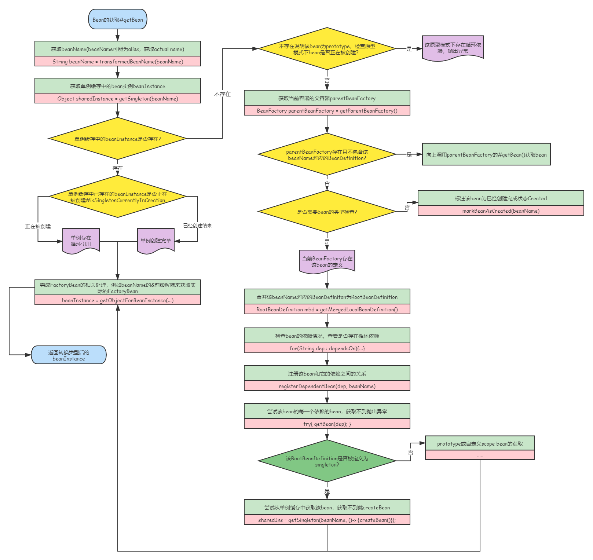

# SpringFramework源码解析——Bean的声明周期源码+图解

## Bean的获取

### 流程图

<div align=center></div>

### AbstractBeanFactory#doGetBean

```java
//AbstractBeanFactory.java
	protected <T> T doGetBean(
			String name, @Nullable Class<T> requiredType, @Nullable Object[] args, boolean typeCheckOnly)
			throws BeansException {

		//获取规范化的bean名称，包括对factory bean的前缀解耦和bean别名的处置
		String beanName = transformedBeanName(name);

		//要返回的bean实例
		Object beanInstance;

		// Eagerly check singleton cache for manually registered singletons.
		//从缓存或者实例工厂中获取bean
		Object sharedInstance = getSingleton(beanName);
		if (sharedInstance != null && args == null) {
			if (logger.isTraceEnabled()) {
				if (isSingletonCurrentlyInCreation(beanName)) {
					logger.trace("Returning eagerly cached instance of singleton bean '" + beanName +
							"' that is not fully initialized yet - a consequence of a circular reference");
				}
				else {
					logger.trace("Returning cached instance of singleton bean '" + beanName + "'");
				}
			}
			//完成FactoryBean的相关处理，用来获取FactoryBean的处理结果
			beanInstance = getObjectForBeanInstance(sharedInstance, name, beanName, null);
		}

		else {
			//Spring只解决单例模式下的循环依赖，如果原型模式下存在循环依赖则会抛出异常
			if (isPrototypeCurrentlyInCreation(beanName)) {
				throw new BeanCurrentlyInCreationException(beanName);
			}

			// 如果当前容器没有找到，就从父容器中查找
			BeanFactory parentBeanFactory = getParentBeanFactory();
			if (parentBeanFactory != null && !containsBeanDefinition(beanName)) {
				// 没有找到，向上找父容器
				String nameToLookup = originalBeanName(name);
				//如果父容器也是AbstractBeanFactory，直接调用父容器的doGetBean
				if (parentBeanFactory instanceof AbstractBeanFactory) {
					return ((AbstractBeanFactory) parentBeanFactory).doGetBean(
							nameToLookup, requiredType, args, typeCheckOnly);
				}
				else if (args != null) {
					//如果父容器不是AbstractBeanFactory类型，那么doGetBean不一定存在，就需要调用getBean
					return (T) parentBeanFactory.getBean(nameToLookup, args);
				}
				else if (requiredType != null) {
					// 没有args参数， 但是requireType不为空，继续尝试获取bean
					return parentBeanFactory.getBean(nameToLookup, requiredType);
				}
				else {
					//至此args, requireType均为空，只通过名字查找
					return (T) parentBeanFactory.getBean(nameToLookup);
				}
			}

			//如果不需要进行类型检查，直接标注此bean为“完成创建”状态
			if (!typeCheckOnly) {
				markBeanAsCreated(beanName);
			}

			//开启spring bean的创建过程，并标注当前beanName以检测性能
			StartupStep beanCreation = this.applicationStartup.start("spring.beans.instantiate")
					.tag("beanName", name);
			try {
				if (requiredType != null) {
					beanCreation.tag("beanType", requiredType::toString);
				}

				//合并bean的定义
				RootBeanDefinition mbd = getMergedLocalBeanDefinition(beanName);
				checkMergedBeanDefinition(mbd, beanName, args);

				// Guarantee initialization of beans that the current bean depends on.
				// 确保当前bean所依赖的bean能够被初始化
				String[] dependsOn = mbd.getDependsOn();
				if (dependsOn != null) {
					for (String dep : dependsOn) {
						//本来是beanName依赖dep，但是这一步如果是dep依赖beanName，就构成了循环依赖
						//出现循环依赖就要抛出异常
						if (isDependent(beanName, dep)) {
							throw new BeanCreationException(mbd.getResourceDescription(), beanName,
									"Circular depends-on relationship between '" + beanName + "' and '" + dep + "'");
						}
						//注册bean之间的依赖关系
						registerDependentBean(dep, beanName);

						try {
							//获取依赖的bean
							getBean(dep);
						}
						catch (NoSuchBeanDefinitionException ex) {
							//如果获取不到，就抛出异常，依赖的Bean不存在
							throw new BeanCreationException(mbd.getResourceDescription(), beanName,
									"'" + beanName + "' depends on missing bean '" + dep + "'", ex);
						}
					}
				}

				// RootDefinition为单例模式
				if (mbd.isSingleton()) {
					sharedInstance = getSingleton(beanName, () -> {
						try {
							return createBean(beanName, mbd, args);
						}
						catch (BeansException ex) {
							// Explicitly remove instance from singleton cache: It might have been put there
							// eagerly by the creation process, to allow for circular reference resolution.
							// Also remove any beans that received a temporary reference to the bean.
							// 显式从单例缓存中删除 Bean 实例
							// 因为单例模式下为了解决循环依赖，可能他已经存在了，所以销毁它
							destroySingleton(beanName);
							throw ex;
						}
					});
					// 从单例缓存中获取该beanInstance
					beanInstance = getObjectForBeanInstance(sharedInstance, name, beanName, mbd);
				}

				else if (mbd.isPrototype()) {
					// It's a prototype -> create a new instance.
					Object prototypeInstance = null;
					try {
						//原型模式下创建之前的操作，主要记录原型模式创建的个数和名称集合
						//并标注当前创建的beanInstance为in-creation状态
						beforePrototypeCreation(beanName);
						//创建bean
						prototypeInstance = createBean(beanName, mbd, args);
					}
					finally {
						//原型模式创建后的操作，将此beanInstance从in-creation状态中移除
						afterPrototypeCreation(beanName);
					}
					//尝试从原型缓存中获取beanInstance
					beanInstance = getObjectForBeanInstance(prototypeInstance, name, beanName, mbd);
				}

				else {
					//如果当前bean还有其他scope，比如web应用中的session等
					String scopeName = mbd.getScope();
					if (!StringUtils.hasLength(scopeName)) {
						throw new IllegalStateException("No scope name defined for bean ´" + beanName + "'");
					}
					Scope scope = this.scopes.get(scopeName);
					if (scope == null) {
						throw new IllegalStateException("No Scope registered for scope name '" + scopeName + "'");
					}
					try {
						//之后都是同样的操作了，只不过此时的缓存变成了scopeInstance缓存
						Object scopedInstance = scope.get(beanName, () -> {
							beforePrototypeCreation(beanName);
							try {
								return createBean(beanName, mbd, args);
							}
							finally {
								afterPrototypeCreation(beanName);
							}
						});
						beanInstance = getObjectForBeanInstance(scopedInstance, name, beanName, mbd);
					}
					catch (IllegalStateException ex) {
						throw new ScopeNotActiveException(beanName, scopeName, ex);
					}
				}
			}
			catch (BeansException ex) {
				//Startup标注
				beanCreation.tag("exception", ex.getClass().toString());
				beanCreation.tag("message", String.valueOf(ex.getMessage()));
				cleanupAfterBeanCreationFailure(beanName);
				throw ex;
			}
			finally {
				//bean创建过程结束
				beanCreation.end();
			}
		}

		//此时获取的bean可能类型不会匹配，因此进行相应的类型转换
		return adaptBeanInstance(name, beanInstance, requiredType);
	}
```

