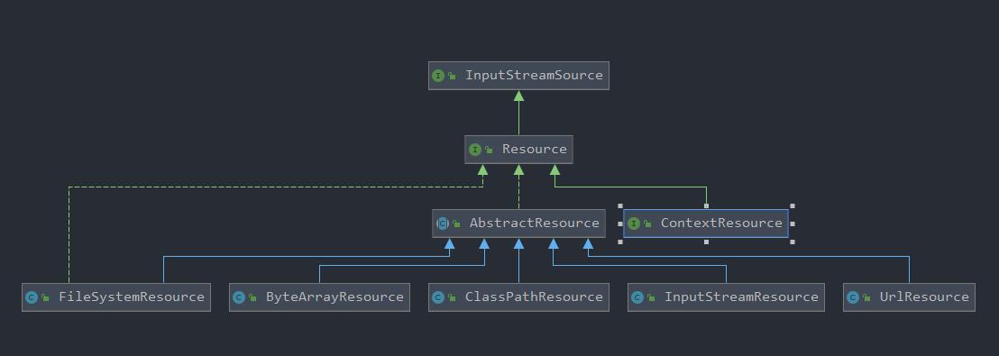
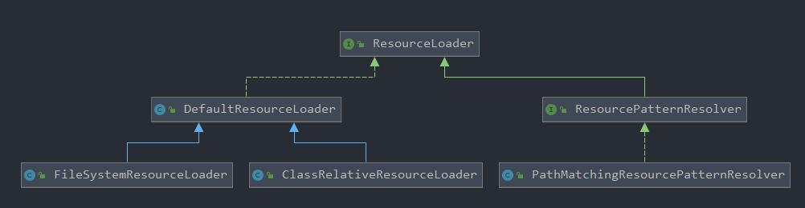

# SpringFramework源码解析——Resource资源加载策略

<!-- vscode-markdown-toc -->
* 1. [为什么Spring不采用Java的URL资源加载策略](#SpringJavaURL)
* 2. [顶级接口Resource](#Resource)
* 3. [Resource的实现](#Resource-1)
* 4. [Resource接口的抽象实现AbstractResource](#ResourceAbstractResource)
* 5. [资源加载器ResourceLoader](#ResourceLoader)
	* 5.1. [ResourcePatternResovler](#ResourcePatternResovler)
		* 5.1.1. [PathMatchingResourcePatternResolver](#PathMatchingResourcePatternResolver)
	* 5.2. [DefaultResourceLoader](#DefaultResourceLoader)
		* 5.2.1. [#getResource](#getResource)
	* 5.3. [FileSystemResourceLoader](#FileSystemResourceLoader)
	* 5.4. [ClassRelativeResourceLoader](#ClassRelativeResourceLoader)
* 6. [总结](#)

<!-- vscode-markdown-toc-config
	numbering=true
	autoSave=true
	/vscode-markdown-toc-config -->
<!-- /vscode-markdown-toc -->

##  1. <a name='SpringJavaURL'></a>为什么Spring不采用Java的URL资源加载策略

为什么要搞懂这个问题，因为这关系到Spring中 `Resource` 存在的意义。

我们都知道`URL` 又被称为统一资源定位器，但是， **它仅限于网络中发布的资源的位置定位** ，而在Spring中，资源可能来自于网络，可能来自于文件，可能来自于二进制流，可能来自于字节流，因此，单纯的`URL`并不能满足所有的开发的需要，这时候，`Resource` 系列诞生了。

搞懂了这个问题，我们就可以开始了Spring资源加载策略源码的探索。

##  2. <a name='Resource'></a>顶级接口Resource

`Resource` 位于 `org.springframework.core.io` 包中。是所有资源加载器的顶级接口，源码如下：

```java
public interface Resource extends InputStreamSource {


	/**
	 * 判断资源是否真实存在(物理上)。
	 *
	 * @return 该资源是否存在
	 */
	boolean exists();


	/**
	 * 判断该Resource的非空内容content是否可读，也许实际读取的时候Resource会读取失败，但是一旦该方法返回false，则表明该
	 * Resource是绝对不可读的
	 *
	 * @return 该资源是否可读
	 */
	default boolean isReadable() {
		return exists();
	}

	/**
	 * 防止资源泄露，判断该资源是否被打开，配合isClosed()方法
	 *
	 * @return 该资源是否被打开
	 */
	default boolean isOpen() {
		return false;
	}

	/**
	 * 判断该资源是否是文件系统下的一个确定的文件
	 *
	 * @return 默认返回false
	 */
	default boolean isFile() {
		return false;
	}

	/**
	 * 返回此资源的URL句柄
	 *
	 * @return 该资源的URL句柄
	 * @throws IOException 如果资源无法被解析为URL，抛出IOException错误
	 */
	URL getURL() throws IOException;

	/**
	 * 类似URL，返回该资源的URI句柄
	 *
	 * @return 该资源的URI句柄
	 * @throws IOException 如果资源无法被解析为URI，抛出IOException错误
	 */
	URI getURI() throws IOException;

	/**
	 * 返回该资源的文件句柄
	 *
	 * @return 该资源的文件句柄
	 * @throws IOException 如果资源无法被解析为File，抛出IOException异常
	 */
	File getFile() throws IOException;

	/**
	 * 返回一个 {@link ReadableByteChannel}.
	 * <p>默认情况下，每一次调用该方法都会返回一个新的Channel.
	 * <p>默认的Channel实现为 {@link Channels#newChannel(InputStream)}
	 * 该方法返回 {@link #getInputStream()}.
	 * @return 该资源对应的字节Channel (must not be {@code null})
	 * @throws java.io.FileNotFoundException 如果资源不存在
	 * @throws IOException 如果该Channel无法被打开
	 * @since 5.0
	 * @see #getInputStream()
	 */
	default ReadableByteChannel readableChannel() throws IOException {
		return Channels.newChannel(getInputStream());
	}

	/**
	 * 该资源的内容长度，这里的长度一定指的是物理存储的长度
	 * @throws IOException 如果资源无法被解析
	 */
	long contentLength() throws IOException;

	/**
	 * 该资源最后一次被修改的时间，时间类型为Timestamp
	 * @throws IOException 如果资源无法被解析
	 */
	long lastModified() throws IOException;

	/**
	 * 创建一个与该资源相关的资源
	 * @param relativePath 该相关资源的路径
	 * @return 该相关资源的Resource句柄
	 * @throws IOException 如果不能确定相对资源
	 */
	Resource createRelative(String relativePath) throws IOException;
	
	@Nullable
	String getFilename();
	
	String getDescription();

}
```

##  3. <a name='Resource-1'></a>Resource的实现

`Resource` 默认情况下有很多实现，这里截取到了几个关键的子实现(implements) ，UML图如下:

<div align=center></div>

- FileSystemResource ：对 `java.io.File` 类型资源的封装，只要是跟 File 打交道的，基本上与 FileSystemResource 也可以打交道。支持文件和 URL 的形式，实现 WritableResource 接口，且从 Spring Framework 5.0 开始，FileSystemResource 使用 NIO2 API进行读/写交互。
- ByteArrayResource ：对字节数组提供的数据的封装。如果通过 InputStream 形式访问该类型的资源，该实现会根据字节数组的数据构造一个相应的 ByteArrayInputStream。
- UrlResource ：对 `java.net.URL`类型资源的封装。内部委派 URL 进行具体的资源操作。
- ClassPathResource ：class path 类型资源的实现。使用给定的 ClassLoader 或者给定的 Class 来加载资源。
- InputStreamResource ：将给定的 InputStream 作为一种资源的 Resource 的实现类。

##  4. <a name='ResourceAbstractResource'></a>Resource接口的抽象实现AbstractResource

AbstractResource位于`org.springframework.core.io` 包下。内部定义了Resource接口的默认实现，子类要想修改默认行文可以通过重写override的方法。

里面比较重要的一个方法就是`exists` 了，这个方法不仅仅判断资源是否存在，还判断该资源是否被打开，因为在Spring中，资源存在的意义就是能够被读取，所以`exists` 还追加了一层readable判断。

```java
	@Override
	public boolean exists() {
		//如果该文件是file类型
		if (isFile()) {
			try {
				// 尝试该文件是否存在
				return getFile().exists();
			}
			catch (IOException ex) {
				Log logger = LogFactory.getLog(getClass());
				if (logger.isDebugEnabled()) {
					logger.debug("Could not retrieve File for existence check of " + getDescription(), ex);
				}
			}
		}
		// 判断存在并不是终点，还要继续判断该文件是否可以打开
		try {
			getInputStream().close();
			return true;
		}
		catch (Throwable ex) {
			Log logger = LogFactory.getLog(getClass());
			if (logger.isDebugEnabled()) {
				logger.debug("Could not retrieve InputStream for existence check of " + getDescription(), ex);
			}
			//input stream流获取失败，则表明该文件并不能被打开
			return false;
		}
	}
```

之后一些具体的类源码就不分析了，这部分并不是那么重要，只是开了一个头，讲述一下Resource到底是什么，想要看更多源码的请移步: [org.springframework.core.io](https://github.com/OxCaffee/spring-source-code-read/tree/main/spring-core/src/main/java/org/springframework/core/io)

##  5. <a name='ResourceLoader'></a>资源加载器ResourceLoader

资源Resource，可能存在于File，可能存在于字节流比特流中等等，如何去加载这些资源？这时候就需要ResourceLoader出场，Spring源码中对ResourceLoader的描述为:

```markdown
Strategy interface for loading resources (e.g., class path or file system resources)
```

也就是说，ResourceLoader是资源加载的一种策略接口，加载的对象仅限于:

1. class path: 类路径下的资源
2. file system: 文件系统下的资源

源码的定义也很简单:

```java
public interface ResourceLoader {

	/** Pseudo URL prefix for loading from the class path: "classpath:". */
	//classpath默认的省略前缀为 "classpath:"
	String CLASSPATH_URL_PREFIX = ResourceUtils.CLASSPATH_URL_PREFIX;


	/**
	 * 获取制定路径下的Resource句柄
	 *
	 * @param location 指定的路径
	 * @return Resource句柄
	 */
	Resource getResource(String location);

	/**
	 * 对外暴露该ResourceLoader使用的ClassLoader
	 */
	@Nullable
	ClassLoader getClassLoader();
}
```

下面我们看看ResourceLoader的类结构

<div align=center></div>

###  5.1. <a name='ResourcePatternResovler'></a>ResourcePatternResovler

位于`org.springframework.core.io.support` 包下，ResourcePatternResolver是一种解析路径格式的策略接口，例如它可以解析Ant风格的路径格式。

ResourcePatternResolver还提供了一种全新的路径匹配风格：`classpath*:` ，这个模式可以匹配classpath下所有的资源。

源码定义如下：

```java
public interface ResourcePatternResolver extends ResourceLoader {

	String CLASSPATH_ALL_URL_PREFIX = "classpath*:";

	Resource[] getResources(String locationPattern) throws IOException;

}
```

####  5.1.1. <a name='PathMatchingResourcePatternResolver'></a>PathMatchingResourcePatternResolver

`org.springframework.core.io.support.PathMatchingResourcePatternResolver` ，为 ResourcePatternResolver 最常用的子类，它除了支持 ResourceLoader 和 ResourcePatternResolver 新增的 `"classpath*:"` 前缀外，**还支持 Ant 风格的路径匹配模式**（类似于 `"**/*.xml"`）。

##### constructor

我们首先关注一下它的构造器，

```java
public PathMatchingResourcePatternResolver() {
	this.resourceLoader = new DefaultResourceLoader();
}
```

在默认情况下，PathMatchingResourcePatternResolver使用的是DefaultResourceLoader。

#####  5.2. <a name='getResources'></a>#getResources

`getResources` 是PathMatchingResourcePatternResolver中比较重要的一个方法.

```java
	@Override
	public Resource[] getResources(String locationPattern) throws IOException {
		Assert.notNull(locationPattern, "Location pattern must not be null");
		// 以 "classpath*:" 开头
		if (locationPattern.startsWith(CLASSPATH_ALL_URL_PREFIX)) {
			// 路径包含通配符
			if (getPathMatcher().isPattern(locationPattern.substring(CLASSPATH_ALL_URL_PREFIX.length()))) {
				return findPathMatchingResources(locationPattern);
			}
			else {
				// 路径不包含通配符
				return findAllClassPathResources(locationPattern.substring(CLASSPATH_ALL_URL_PREFIX.length()));
			}
		}
		// 不以 "classpath*:" 开头
		else {
			// Generally only look for a pattern after a prefix here,
			// 通常只在这里的前缀后面查找模式
			// and on Tomcat only after the "*/" separator for its "war:" protocol.
			//而在 Tomcat 上只有在 “*/ ”分隔符之后才为其 “war:” 协议
			int prefixEnd = (locationPattern.startsWith("war:") ? locationPattern.indexOf("*/") + 1 :
					locationPattern.indexOf(':') + 1);
			// 路径包含通配符
			if (getPathMatcher().isPattern(locationPattern.substring(prefixEnd))) {
				// a file pattern
				return findPathMatchingResources(locationPattern);
			}
			// 路径不包含通配符
			else {
				// a single resource with the given name
				return new Resource[] {getResourceLoader().getResource(locationPattern)};
			}
		}
	}
```

- **非** `"classpath*:"` 开头，且路径**不包含**通配符，直接委托给相应的 ResourceLoader 来实现。
- 其他情况，调用 `#findAllClassPathResources(...)`、或 `#findPathMatchingResources(...)` 方法，返回多个 Resource 。下面，我们来详细分析。

#####  5.3. <a name='findAllClassPathResources'></a>findAllClassPathResources

```java
protected Resource[] findAllClassPathResources(String location) throws IOException {
	String path = location;
	// 去除首个 /
	if (path.startsWith("/")) {
		path = path.substring(1);
	}
	// 真正执行加载所有 classpath 资源
	Set<Resource> result = doFindAllClassPathResources(path);
	if (logger.isTraceEnabled()) {
		logger.trace("Resolved classpath location [" + location + "] to resources " + result);
	}
	// 转换成 Resource 数组返回
	return result.toArray(new Resource[0]);
}
```

真正执行加载的是在 `#doFindAllClassPathResources(...)` 方法，代码如下：

```java
protected Set<Resource> doFindAllClassPathResources(String path) throws IOException {
	Set<Resource> result = new LinkedHashSet<>(16);
	ClassLoader cl = getClassLoader();
	// <1> 根据 ClassLoader 加载路径下的所有资源
	Enumeration<URL> resourceUrls = (cl != null ? cl.getResources(path) : ClassLoader.getSystemResources(path));
	// <2>
	while (resourceUrls.hasMoreElements()) {
		URL url = resourceUrls.nextElement();
		// 将 URL 转换成 UrlResource
		result.add(convertClassLoaderURL(url));
	}
	// <3> 加载路径下得所有 jar 包
	if ("".equals(path)) {
		// The above result is likely to be incomplete, i.e. only containing file system references.
		// We need to have pointers to each of the jar files on the classpath as well...
		addAllClassLoaderJarRoots(cl, result);
	}
	return result;
}
```

#####  5.4. <a name='findPathMatchingResources'></a>findPathMatchingResources

当 `locationPattern` 中包含了**通配符**，则调用该方法进行资源加载。代码如下：

```java
protected Resource[] findPathMatchingResources(String locationPattern) throws IOException {
    // 确定根路径、子路径
    String rootDirPath = determineRootDir(locationPattern);
    String subPattern = locationPattern.substring(rootDirPath.length());
    // 获取根据路径下的资源
    Resource[] rootDirResources = getResources(rootDirPath);
    // 遍历，迭代
    Set<Resource> result = new LinkedHashSet<>(16);
    for (Resource rootDirResource : rootDirResources) {
        rootDirResource = resolveRootDirResource(rootDirResource);
        URL rootDirUrl = rootDirResource.getURL();
        // bundle 资源类型
        if (equinoxResolveMethod != null && rootDirUrl.getProtocol().startsWith("bundle")) {
            URL resolvedUrl = (URL) ReflectionUtils.invokeMethod(equinoxResolveMethod, null, rootDirUrl);
            if (resolvedUrl != null) {
                rootDirUrl = resolvedUrl;
            }
            rootDirResource = new UrlResource(rootDirUrl);
        }
        // vfs 资源类型
        if (rootDirUrl.getProtocol().startsWith(ResourceUtils.URL_PROTOCOL_VFS)) {
            result.addAll(VfsResourceMatchingDelegate.findMatchingResources(rootDirUrl, subPattern, getPathMatcher()));
        // jar 资源类型
        } else if (ResourceUtils.isJarURL(rootDirUrl) || isJarResource(rootDirResource)) {
            result.addAll(doFindPathMatchingJarResources(rootDirResource, rootDirUrl, subPattern));
        // 其它资源类型
        } else {
            result.addAll(doFindPathMatchingFileResources(rootDirResource, subPattern));
        }
    }
    if (logger.isTraceEnabled()) {
        logger.trace("Resolved location pattern [" + locationPattern + "] to resources " + result);
    }
    // 转换成 Resource 数组返回
    return result.toArray(new Resource[0]);
}
```


###  5.2. <a name='DefaultResourceLoader'></a>DefaultResourceLoader

位于`org.springframework.core.io` 包下。DefaultResourceLoader是ResourceLoader接口的默认实现。同时也是其他ResourceLoader实现类的基类。

DefaultResourceResolver不仅支持常见的一些资源的加载措施，**还支持用户自定义的一些资源，例如SPI机制等protocol-specified** 资源的加载措施，首先我们先来看看DefaultResourceLoader的声明:

```java
public class DefaultResourceLoader implements ResourceLoader {

	@Nullable
	private ClassLoader classLoader;

	//用户自定义的一些解析器，例如SPI机制等
	private final Set<ProtocolResolver> protocolResolvers = new LinkedHashSet<>(4);

	//资源缓存
	private final Map<Class<?>, Map<Resource, ?>> resourceCaches = new ConcurrentHashMap<>(4);
    
    ...
}
```

其中最重要的核心方法莫过于`#getResource` 方法了。

####  5.2.1. <a name='getResource'></a>#getResource

```java
	@Override
	public Resource getResource(String location) {
		//location判空
		Assert.notNull(location, "Location must not be null");

		//首先尝试用户自定义的解析器，尝试解析resource
		for (ProtocolResolver protocolResolver : getProtocolResolvers()) {
			//每个解析器依次尝试解析
			Resource resource = protocolResolver.resolve(location, this);
			if (resource != null) {
				return resource;
			}
		}

		//到这，说明前面都没有解析成功
		//判断路径是否以/开始
		if (location.startsWith("/")) {
			//如果以"/"作为开始，说明可以通过路径解析
			return getResourceByPath(location);
		}
		//如果以"classpath*:"开始
		else if (location.startsWith(CLASSPATH_URL_PREFIX)) {
			//从类路径下解析
			return new ClassPathResource(location.substring(CLASSPATH_URL_PREFIX.length()), getClassLoader());
		}
		else {
			try {
				// 如果既不是file system，又不是classpath，那么只能从URL中解析
				URL url = new URL(location);
				return (ResourceUtils.isFileURL(url) ? new FileUrlResource(url) : new UrlResource(url));
			}
			catch (MalformedURLException ex) {
				// No URL -> resolve as resource path.
				return getResourceByPath(location);
			}
		}
	}
```

可以看到上面的获取Resource可以分为下面几步：

1. 尝试用户自定义解析器解析路径资源(为什么要这样做?)
2. 若1解析失败，尝试从file system中解析
3. 若2解析失败，尝试从classpath下解析
4. 若2,3均失败，尝试从URL中解析

上面留了一个问题，为什么要先尝试用户自定义解析器?

**因为用户自定义的行为往往是为了覆盖接口的默认行为，因此如果用户自定义解析成功，就没有必要继续往后执行了** 。

有了上面资源加载器基类的解析，我们接着往下看其两个重要的实现类`FileSystemResourceLoader` 和`ClassRelativeResourceLoader` 的实现细节。

###  5.3. <a name='FileSystemResourceLoader'></a>FileSystemResourceLoader

其实 DefaultResourceLoader 对`#getResourceByPath(String)` 方法处理其实不是很恰当，这个时候我们可以使用 `org.springframework.core.io.FileSystemResourceLoader` 。它继承 DefaultResourceLoader ，且覆写了 `#getResourceByPath(String)` 方法，使之从文件系统加载资源并以 FileSystemResource 类型返回，这样我们就可以得到想要的资源类型。代码如下：

```java
@Override
protected Resource getResourceByPath(String path) {
	// 截取首 /
	if (path.startsWith("/")) {
		path = path.substring(1);
	}
	// 创建 FileSystemContextResource 类型的资源
	return new FileSystemContextResource(path);
}
```

里面出现了一个FileContextResource。FileSystemContextResource ，为 FileSystemResourceLoader 的内部类，它继承 FileSystemResource 类，实现 ContextResource 接口。代码如下：

```java
private static class FileSystemContextResource extends FileSystemResource implements ContextResource {

	public FileSystemContextResource(String path) {
		super(path);
	}

	@Override
	public String getPathWithinContext() {
		return getPath();
	}
}
```

###  5.4. <a name='ClassRelativeResourceLoader'></a>ClassRelativeResourceLoader

ClassRelativeResourceLoader也一样，重写了基类的默认行为，使之能更好地加载classpath下的资源。

```java
	@Override
	protected Resource getResourceByPath(String path) {
		return new ClassRelativeContextResource(path, this.clazz);
	}
```

这里返回了ClassRelativeContextResource，这也是一个静态内部类。**因为classpath并不是一个完整的路径，而是一个相对路径，相对于谁而言？相对于classpath而言，所以在加载类路径下的资源的时候，首先要考虑如何把relativepath转化为location**

##  6. <a name=''></a>总结

- Spring 提供了 Resource 和 ResourceLoader 来统一抽象整个资源及其定位。使得资源与资源的定位有了一个更加清晰的界限，并且提供了合适的 Default 类，使得自定义实现更加方便和清晰。
- AbstractResource 为 Resource 的默认抽象实现，它对 Resource 接口做了一个统一的实现，子类继承该类后只需要覆盖相应的方法即可，同时对于自定义的 Resource 我们也是继承该类。
- DefaultResourceLoader 同样也是 ResourceLoader 的默认实现，在自定 ResourceLoader 的时候我们除了可以继承该类外还可以实现 ProtocolResolver 接口来实现自定资源加载协议。
- DefaultResourceLoader 每次只能返回单一的资源，所以 Spring 针对这个提供了另外一个接口 ResourcePatternResolver ，该接口提供了根据指定的 locationPattern 返回多个资源的策略。其子类 PathMatchingResourcePatternResolver 是一个集大成者的 ResourceLoader ，因为它即实现了 `Resource getResource(String location)` 方法，也实现了 `Resource[] getResources(String locationPattern)` 方法。